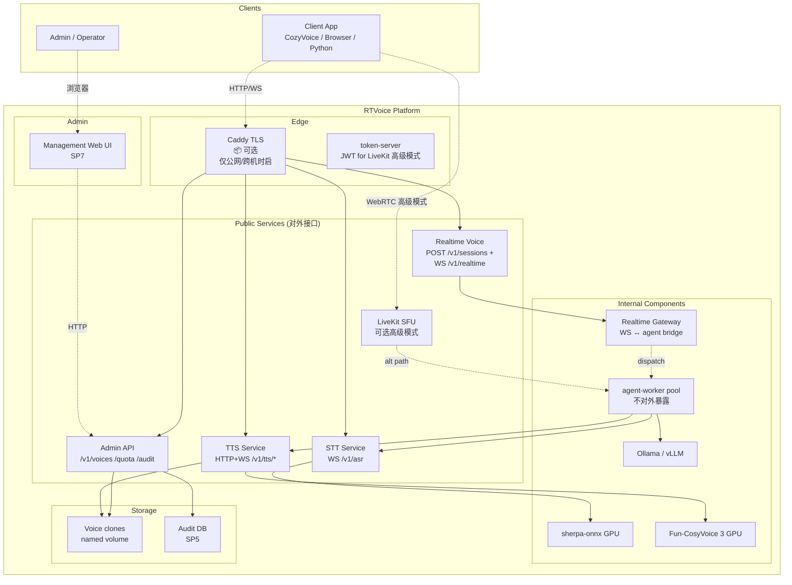
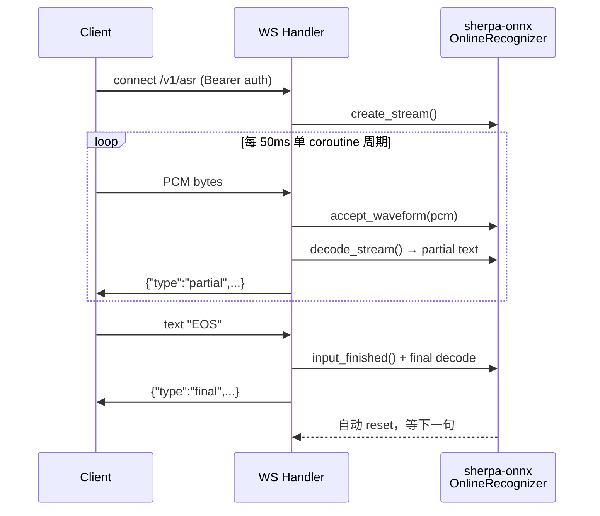
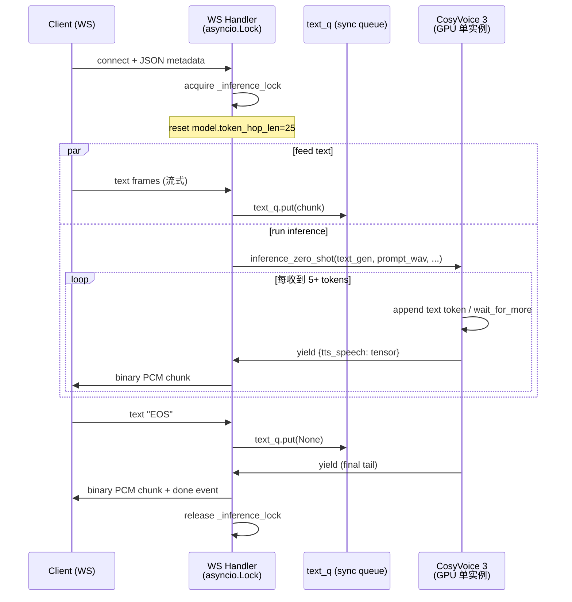
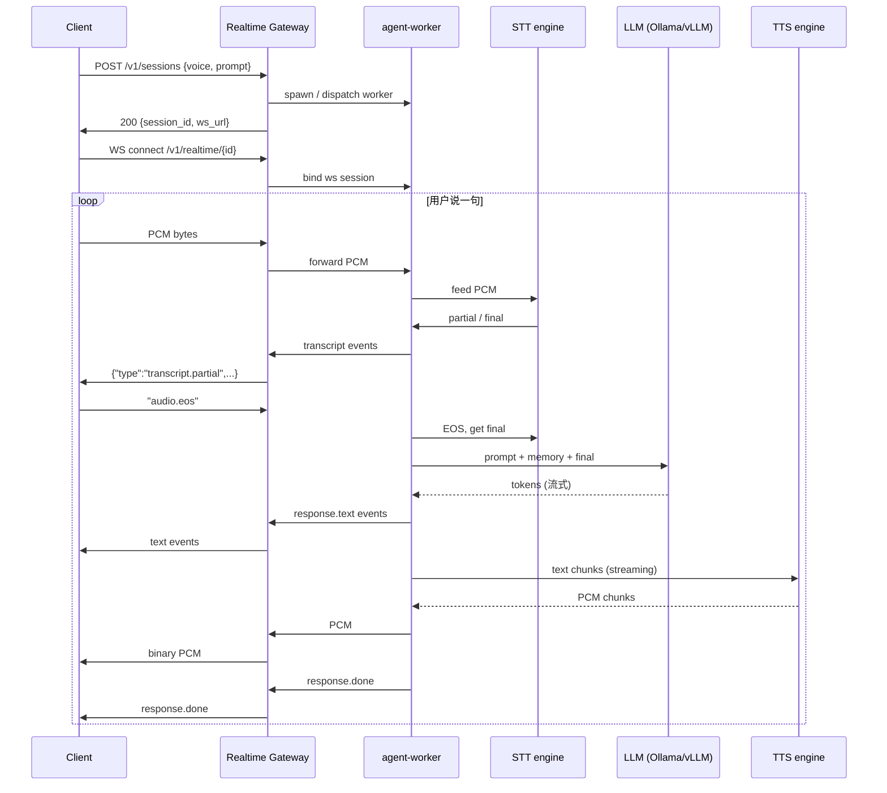
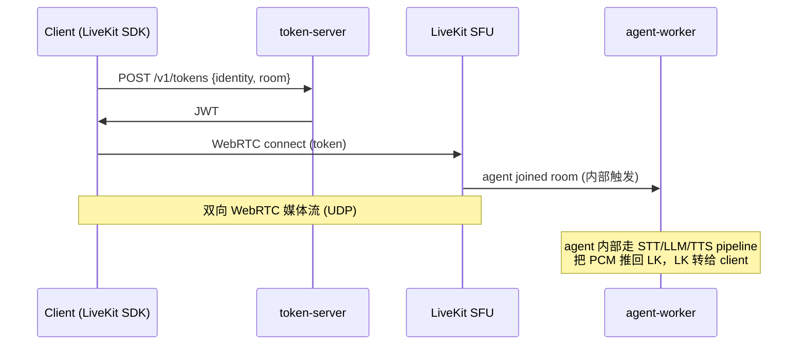

# RTVoice 架构文档

> **本文档面向：** 想了解 RTVoice 内部如何工作的开发者、新贡献者、架构 reviewer。
> **配合阅读：** [README.md](./README.md)（高层概览）、[OPERATIONS.md](./OPERATIONS.md)（运维细节）、[ENGINES.md](./ENGINES.md)（选型对比）。

RTVoice 是 voice services platform，对外提供 3 个对等 service（STT / TTS / Realtime Voice）。本文档分章节描述各 service 的内部实现、跨服务关注点（鉴权 / GPU / 容错）、技术栈选型与设计决策日志。

---

## §1 Platform Overview



**关键观察:**

- **3 个 service 平等**：STT / TTS / Realtime Voice 都是 public API surface
- **Realtime Voice 双路径**：默认 WS gateway（OpenAI Realtime 风格 / server-to-server 友好）；LiveKit 可选高级模式（end-user 跨公网移动场景）
- **agent-worker = 内部组件**：客户端永远不直接接触；只通过 Realtime Gateway 间接调度
- **Caddy 可选**：仅公网或不信任内网时启用；同机 docker network 部署不需要
- **Storage 层**：voice clones 是 named volume；audit DB 在 SP5 引入

---

## §2 STT Service

### 接口签名

```
WS /v1/asr
  client → server: binary frames (PCM int16 LE 16kHz mono)
                    + text "EOS" (触发 final)
  server → client: JSON events
                    {"type":"partial", "text":"..."}
                    {"type":"final", "text":"..."}
                    {"type":"error", "message":"..."}
```

### 内部组件



### 关键设计权衡

- **单 coroutine 处理**：sherpa-onnx Stream 不是 thread-safe；旧版 v0.5.2 用 decode_loop + EOS handler 两个 task 并发访问 stream 导致 native crash。v0.5.3 改单 coroutine：receive WS msg（带超时）→ accept_waveform 或 EOS 处理 → decode → emit partial，全程一个协程操作 stream，无并发无 race。
- **endpoint detection 关闭**：sherpa 自身的 endpoint 检测会异步 reset stream，与我们的 EOS 控制冲突；统一由客户端发 "EOS" 控制 final 时机。

### 容错

- 客户端 WS 断 → 服务端释放 stream
- 服务端 WS 重启 → 客户端 STTClient 走 5 次指数退避重连（1→2→4→8→16s），重连后用新 stream（当前 utterance 数据丢失，下一轮恢复正常）

### 不在范围

- 多语言切换（默认中英文 bilingual）：未来用户可换 sherpa-onnx 模型；具体见 [ENGINES.md](./ENGINES.md)
- 说话人识别 / diarization：业界另起方案，本平台不内嵌

---

## §3 TTS Service

### 接口签名

```
HTTP POST /v1/tts/stream
  request body: JSON {"text":"...", "voice":"...", "speed":1.0}
  response: chunked transfer, binary PCM int16 LE 24kHz mono
  headers: X-Sample-Rate=24000, X-Channels=1, X-Format=pcm-int16-le

WS /v1/tts/stream_ws
  client → server:
    text frame 1 (JSON metadata): {"voice":"...","speed":1.0}
    text frame N: 文本增量（可流式喂入）
    text "EOS" (触发结束)
  server → client:
    binary PCM chunks
    text {"type":"done","chunks":N} 末帧
    或 text {"type":"error","message":"..."}
```

### 内部组件 + 双向流式数据流



### 关键设计权衡

- **asyncio.Lock 串行化（v0.7.2 修复）**：CosyVoice 单 GPU model 实例并发调用会污染内部 state。所有 inference 入口（HTTP `_synthesize_stream` 和 WS `tts_stream_ws`）都包在 `async with _inference_lock`，N 路并发自动排队。Trade-off：吞吐受 GPU 单实例限制（baseline 单路 ~1.5s，5 路并发 ~6s 串行）。
- **CosyVoice instance-attr 重置规约**：`model.token_hop_len` 在 v3 内部 stream 路径单调递增（25→50→100），跨 inference 共享。每路 inference 开始前手动 `model.token_hop_len = 25` reset。
- **HTTP path generator wrap（v0.7.3 修复）**：CosyVoice 3 在 `tts_text=str` + 短文本下走"等满 hop_len 才 yield"的旧路径，遇到边界 bug（hifigan F0 kernel/input mismatch）。HTTP path 包成 single-element generator → 走稳定的"边收边 decode"路径。
- **prompt_text 必须含 `<|endofprompt|>`**：CosyVoice 3 LLM `inference()` 硬断言（v3 frontend 不自动加，caller 必须显式拼）。

### Voice Clone

```
POST /v1/voices  (multipart, TTS_ADMIN_API_KEY 鉴权)
  - file: 16kHz mono wav (3-30 秒)
  - spk_id: 新音色 ID
  - prompt_text: 参考音对应的文字 (≥3 秒发音内容)
↓
add_zero_shot_spk() 注册 → spk2info.pt 持久化到 named volume
↓
重启自动 reload，POST /v1/tts/stream voice=新id 即可用

DELETE /v1/voices/{spk_id}  (默认音色保护，不可删)
```

### 容错

- HTTP path: `request.is_disconnected()` 监测，client 断则停止推理
- WS path: barge-in `asyncio.shield(ws.aclose, timeout=2)` 让 close frame 真发出；server 端 `send_bytes` 接 `(WebSocketDisconnect, RuntimeError)` 双异常防 starlette send-after-close trap

---

## §4 Realtime Voice Service

### 接口签名（默认 WS gateway 模式）

```
HTTP POST /v1/sessions
  request body: {"voice":"...", "prompt":"...", ...}
  response: {"session_id":"...", "ws_url":"ws://.../v1/realtime/{id}"}

WS /v1/realtime/{session_id}
  client → server:
    text frame {"type":"session.update", ...}     (可选，热改 voice/prompt)
    binary frame: PCM int16 LE 16kHz mono         (用户音频)
    text "audio.eos"                               (用户发言结束)
  server → client:
    text {"type":"transcript.partial", "text":"..."}    (STT 中间结果)
    text {"type":"transcript.final",   "text":"..."}    (STT 最终)
    text {"type":"response.text",       "text":"..."}   (agent 回复文本，逐 token / 逐句)
    binary frames                                       (agent 回复 PCM 24kHz mono)
    text {"type":"response.done"}                       (本轮回复结束)
    text {"type":"error", "message":"..."}
```

### 数据流（默认 WS gateway 模式）



### 数据流（可选 LiveKit 高级模式）



### Session 生命周期（抽象，详细 SP2 设计）

```
create → active → idle → expire
   ↓        ↓       ↓       ↓
  worker  双向流  超时   清理 memory
  分配          倒计时  释放 worker
```

详细 session API、memory 模型（追加 / 滑窗 / 摘要 / 持久化）、prompt 透传规则属于 SP2/SP3 设计范围，不在本架构文。

### 关键设计权衡

- **WS gateway 默认 vs LiveKit 备选（D-2026-05-07.4）**：server-to-server 场景下 TCP/WS 与 UDP/WebRTC 延迟差异 < 1ms（同 LAN/同机部署），WS gateway 集成简化压倒性优势。LiveKit 仅在末端用户跨公网移动场景保留。
- **agent-worker = 内部 implementation（D-2026-05-07.3）**：客户端永远只看到 WS gateway endpoint，不接触 agent-worker；保留我们内部演进自由。
- **同进程调用 vs HTTP 调用内部 STT/TTS**：当前 agent-worker 通过 HTTP/WS 调内部 STT/TTS server（即使在同一 docker network 也走 HTTP）。代价是几 ms 序列化延迟；好处是 STT/TTS service 同时给外部客户端用，agent-worker 只是其中一个 client。**这与 platform 定位一致**。

---

## §5 跨服务关注点

### 鉴权三层

| 层 | env | 用途 |
|---|---|---|
| Client API key | `RTVOICE_API_KEY` | STT WS / TTS HTTP+WS / Realtime Voice 的 client 调用 Bearer 鉴权（留空 = dev 模式无鉴权）|
| Admin key | `TTS_ADMIN_API_KEY` | `/v1/voices /v1/voices/{id} /quota` 等高权限管理操作（留空 = admin 端点禁用）|
| LiveKit JWT | token-server | 仅 LiveKit 高级模式；token-server 用 `LIVEKIT_API_KEY/SECRET` 签 JWT |

### TLS（可选）

- 同机 docker network：不需要
- 同机 127.0.0.1 bind：不需要
- LAN 跨机（信任）：可选
- LAN 跨机（半信任）：建议（Caddy `tls internal` 自签）
- **公网暴露：必须**（Caddy + Let's Encrypt）

### GPU 显存预算（按 LLM 选型）

| 场景 | sherpa | CosyVoice 3 | LLM | 总计 | 12GB 余量 |
|---|---|---|---|---|---|
| dev (Q4 1.5B) | 1G | 5.5G | 1.5G | **8G** | 4G ✓ 宽裕 |
| prod (Q4 3B) | 1G | 5.5G | 3G | **9.5G** | 2.5G ✓ |
| prod (Q4 7B) | 1G | 5.5G | 5G | **11.5G** | 0.5G ⚠️ 边缘 |

> 多并发 session 时，agent-worker 数 × 每路 STT/TTS 占用要分别累加；详 SP2 设计。

### 容错矩阵

完整列表见 [OPERATIONS.md §1](./OPERATIONS.md)。本文不重复，关键摘要：

- LiveKit room 断 → 5 次指数退避重连
- STT 长连接 → 自愈 reconnect loop
- LLM 流式 → httpx per-chunk timeout + 0-token fallback
- TTS WS barge-in → `shield(aclose)` + server 接 RuntimeError
- CosyVoice multi-concurrency → asyncio.Lock 串行 + `token_hop_len` reset

### 监控

每个 service 暴露 Prometheus `/metrics`：

| Service | 关键指标 |
|---|---|
| token-server | `rtvoice_tokens_issued_total`, `rtvoice_token_auth_failures_total{reason}` |
| stt-server | `rtvoice_stt_ws_connections_active`, `rtvoice_stt_decode_seconds` |
| tts-server | `rtvoice_tts_phrases_total`, `rtvoice_tts_ttfb_seconds`, `rtvoice_tts_phrase_rtf` |
| agent-worker | `rtvoice_round_seconds`, `rtvoice_first_audio_seconds`, `rtvoice_agent_state` |

可选 `--profile monitoring` 起 Prometheus + Grafana stack（21 panels dashboard）。详 `monitoring/README.md`。

---

## §6 技术栈选型

| 组件 | 选型 | 替代方案 | 为什么这个 |
|---|---|---|---|
| **SFU/WebRTC** | LiveKit `livekit/livekit-server:v1.11.0` | Daily / Janus / Mediasoup | 文档 + 多语言 SDK 最完整，开源活跃，docker image 直接用 |
| **STT** | sherpa-onnx Streaming Zipformer 中英文 | whisper / faster-whisper | 真流式（whisper 系是分块伪流式）+ GPU 兼容性 + 模型小 |
| **TTS** | Fun-CosyVoice 3 (0.5B GPU) | Kokoro / XTTS-v2 / ElevenLabs | v3 双向流式（边收文本边吐音频）+ 中文 SOTA + 完全本地 + 音色克隆 |
| **LLM** | Ollama (dev) / vLLM (prod) | 直接 transformers / llama.cpp | OpenAI API 兼容 + 开箱即用模型管理 + 易切换 |
| **Web 框架** | FastAPI + uvicorn | Flask / aiohttp | async-first + Pydantic 校验 + WS 原生支持 |
| **TLS Proxy** | Caddy 2.8 | nginx + certbot | 自动 ACME + 配置 1/10 体积 |
| **监控** | Prometheus + Grafana | Datadog / NewRelic | 自托管 + 文本协议 + 无供应商绑定 |
| **WS 客户端** | `websockets` (Python) | `aiohttp` / `httpx-ws` | 协议合规 + maintainer 活跃 |

详细对比见 [ENGINES.md](./ENGINES.md)。

> **第三方依赖**：LiveKit Server / SDK、sherpa-onnx、Fun-CosyVoice、Ollama 都是开源项目；我们用而**不重新发明**。RTVoice 的价值在于把这些组合成 platform。

---

## §7 设计决策日志

每条记录格式：`D-YYYY-MM-DD.N · 决策标题`，含背景、决定、替代方案、理由。按时间倒序。

### D-2026-05-07.6 · Caddy TLS 标"可选"

**决策**：架构图 Caddy 用虚线 + "📦 可选" 标注；明确公网必须、内网可选、同机不需要。

**理由**：Bearer auth (`RTVOICE_API_KEY`) 是独立鉴权层，Caddy 只解决传输加密。不应让读者误以为"不开 Caddy 就跑不起来"。

### D-2026-05-07.5 · API 规范延后到 SP1.5

**决策**：SP1 仅做叙事重构；路径风格 / 错误码 / 版本 / 鉴权统一规则 / capability discovery 留 SP1.5 独立 sub-project。

**理由**：API 规范影响后续 SP2-7 的设计，需要专注；与 SP1 改文档不冲突。

### D-2026-05-07.4 · WS gateway primary, LiveKit 备选

**决策**：Realtime Voice service 默认走 `WS /v1/realtime`（OpenAI Realtime 风格）；LiveKit endpoint 保留作 advanced mode（仅末端 user 跨公网移动）。

**替代**：纯 LiveKit (v0.7 现状) - 集成方多 SDK 依赖；纯 WS gateway 删 LiveKit - 失去末端跨公网韧性。

**理由**：server-to-server 场景下 TCP/WS 与 UDP/WebRTC 延迟差异 < 1ms（同 LAN/同机），WS gateway 集成简化优势压倒性。

### D-2026-05-07.3 · agent-worker = Model A 内部 implementation detail

**决策**：agent-worker 是 Realtime Voice service 的内部 worker，客户端永远不直接接触；只在 §运维 / §概念 出现，不在 §集成。

**替代**：Model B reference impl（公开 worker 协议）/ Model C default tenant + 渐进 multi-tenant。

**理由**：保留内部演进自由；与 OpenAI Realtime / Vapi / Twilio 行业惯例一致；客户体验最简。

### D-2026-05-07.2 · README 多受众分章节

**决策**：README 第一屏 5 行 pitch + 60 秒 try + 3 service cards；后段分 §集成 / §部署 / §概念 / §Roadmap。

**理由**：3 类受众（集成方 / 运维 / 好奇者）混合入口流量，单视角 README 都不友好。

### D-2026-05-07.1 · 三个 service 完全平铺

**决策**：3 service 同等大小 cards；feature/API list 等篇幅；不分层（不写 STT/TTS 是底层、Realtime 上层）。

**理由**：用户期望"3 service 一等公民"，不让 Realtime 显得独立优越。

### D-2026-05-06.4 · CosyVoice 3 与 v0.6 镜像并存可瞬切回滚

**决策**：v0.7 baseline 通过 `Dockerfile.cosyvoice3` + 单独 image tag 引入；v0.6 image 保留；切换由 `.env` `TTS_DOCKERFILE/TTS_IMAGE` 控制。

**理由**：模型 ~5.6GB + 依赖大，rebuild 高成本；保留双镜像 = 回滚秒级。

### D-2026-05-06.3 · CosyVoice 3 prompt_text 必须含 `<|endofprompt|>`

**决策**：在 `main_cosyvoice3.py::DEFAULT_PROMPT_TEXT` 末尾显式拼 `<|endofprompt|>` token。

**理由**：CosyVoice 3 LLM `inference()` 硬断言 token 151646 必须在输入序列；v3 frontend 不自动添加。这是 vendor undocumented contract，prod 实测才发现。

### D-2026-05-06.2 · ubuntu22.04 + cuda devel base image

**决策**：Dockerfile.cosyvoice3 用 `nvidia/cuda:12.6.3-devel-ubuntu22.04`（不用 ubuntu24.04 + deadsnakes PPA，不用 runtime image）。

**理由**：devel 自带 nvcc 12.6（deepspeed 探测 CUDA 必需）；ubuntu22.04 默认 python3=3.10.12（CosyVoice 兼容）；deadsnakes PPA 国内 TLS 握手频繁失败。

### D-2026-05-04.1 · CosyVoice 用 inference_zero_shot 不用 inference_sft

**决策**：CosyVoice 2 model 在 `add_zero_shot_spk` 注册的是 zero-shot schema（`llm_embedding/flow_embedding`），与 SFT 路径 schema (`embedding`) 不兼容。统一用 `inference_zero_shot(zero_shot_spk_id=...)`。

**理由**：v2 0.5B 不带 SFT spk2info.pt，无法走 inference_sft；强行走会 KeyError。

---

## 历史 / 进一步阅读

- [README.md](./README.md) — 高层概览
- [OPERATIONS.md](./OPERATIONS.md) — 运维细节、容错矩阵、build 性能
- [DEPLOY.md](./DEPLOY.md) — 部署步骤
- [ENGINES.md](./ENGINES.md) — 引擎对比详细
- [CHANGELOG.md](./CHANGELOG.md) — 版本演进
- [SECURITY.md](./SECURITY.md) — 安全契约
- [PROD_VALIDATION.md](./PROD_VALIDATION.md) — v0.7 prod 实测报告
