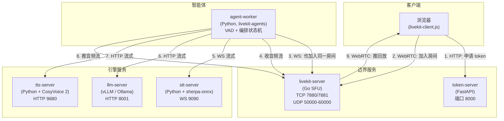
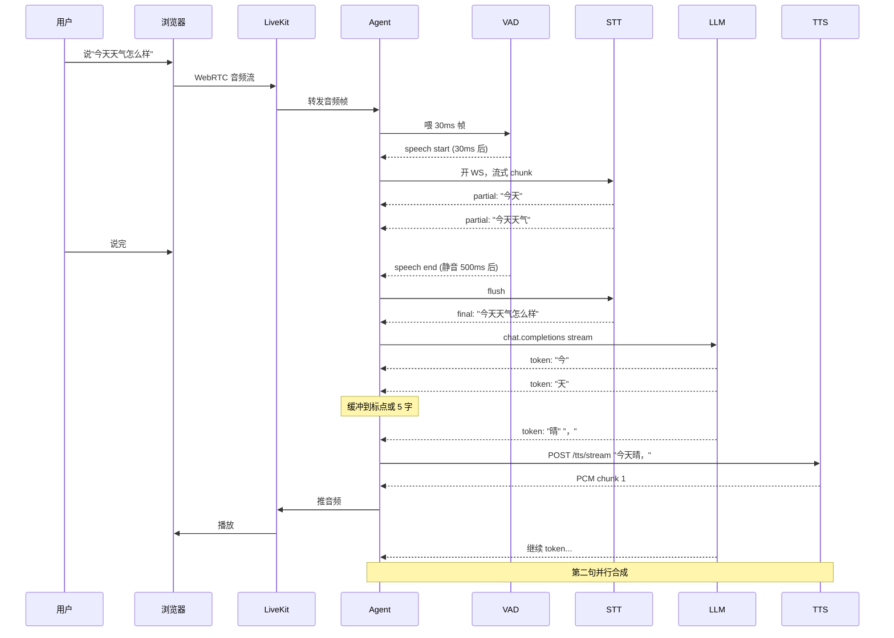
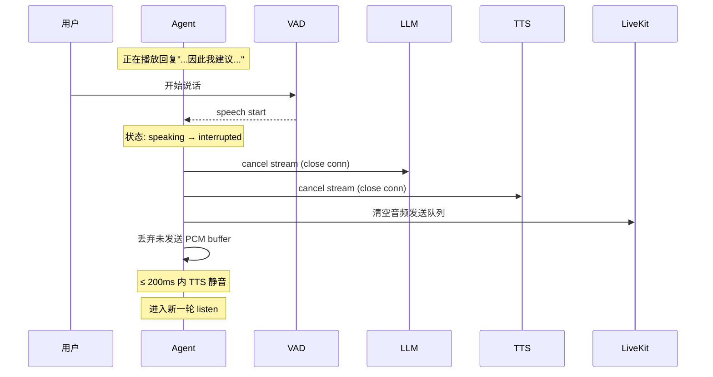
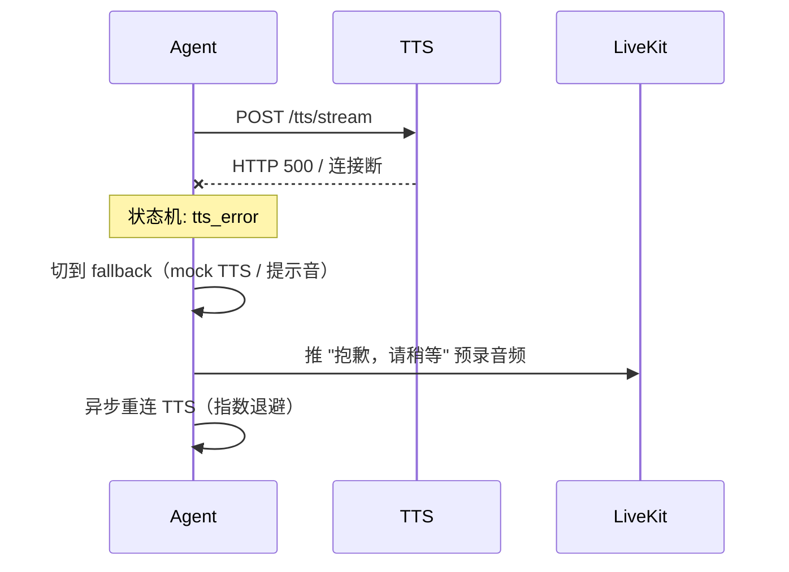
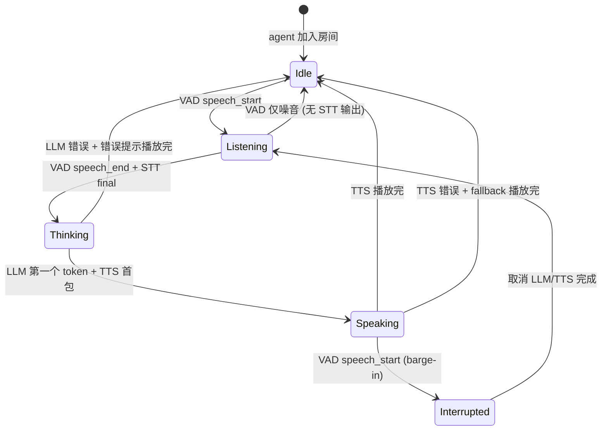

# RTVoice 架构

本文档描述 RTVoice 实时语音对话系统的组件、数据流、关键时序、状态机与性能预算。
读完本文档应能回答：**一段用户音频从麦克风到听到回复，每一比特经过了哪些进程，何时被消费、何时被产生、谁在控制什么**。

配套文档：[SECURITY.md](./SECURITY.md)、[DEPLOY.md](./DEPLOY.md)

---

## 1. 设计目标与非目标

### 1.1 目标

| # | 目标 | 验收标准 |
|---|---|---|
| G1 | 实时语音对话 | 端到端延迟（用户说完到听到回复）≤ 1.2s p95 |
| G2 | 流式合成 | TTS 首包播放 ≤ 300ms（从 LLM 第一个 token 起算） |
| G3 | Barge-in | 用户开始说话后 ≤ 200ms 停止当前 TTS 播放 |
| G4 | 完全本地 | 无外部 API 依赖，断网可用 |
| G5 | 单机 GPU 跑得动 | 总显存 ≤ 10GB（3060 12GB 留余量） |
| G6 | 工程可维护 | 引擎可换（STT/TTS/LLM 独立服务），配置 dev/prod 切换 |

### 1.2 非目标

- **不**追求音色克隆质量（那是另一种产品形态，见 GPT-SoVITS 备选）
- **不**支持多人同时对话同一个 agent（每个房间一个 agent worker，多人对话需扩展）
- **不**做长期记忆/RAG（先做对话本身，记忆是后续扩展）
- **不**做移动端 SDK（先做浏览器/桌面客户端）

---

## 2. 组件全景

### 2.1 部署单元



### 2.2 组件职责

| 组件 | 进程数 | 语言 | GPU | 职责 |
|---|---|---|---|---|
| **livekit-server** | 1 | Go | ❌ | WebRTC SFU，房间/媒体路由，鉴权 |
| **token-server** | 1 | Python | ❌ | 验证客户端身份，签发 LiveKit JWT |
| **agent-worker** | 1+ | Python | ❌（VAD CPU 即可） | 加入房间，运行编排状态机：VAD → STT → LLM → TTS，处理 turn-taking 和 barge-in |
| **stt-server** | 1 | Python | ✅（生产） | 流式 ASR，WS 协议，输入 PCM 流 / 输出 partial+final 文本 |
| **tts-server** | 1 | Python | ✅（生产） | 流式 TTS，HTTP chunked，输入文本 / 输出 PCM 流 |
| **llm-server** | 1 | Python | ✅（生产） | OpenAI 兼容 API，流式 chat completion |

### 2.3 为什么这样切分

- **STT/TTS/LLM 独立成进程**：模型加载慢（10-30s），容器化后崩溃重启不影响 agent；依赖冲突大（torch 版本各家不一），独立镜像更干净；生产可独立 scale。
- **agent-worker 不持有大模型**：状态机和模型解耦，便于换引擎；agent 重启 < 1s 不影响用户。
- **代价**：进程间多 1-2 跳网络（同主机 docker network ~1-2ms，可忽略）。

---

## 3. 数据流

### 3.1 三种数据流

| 流类型 | 方向 | 协议 | 编码 | 速率 |
|---|---|---|---|---|
| **上行音频** | Browser → LiveKit → agent → STT | WebRTC → 内部 PCM | Opus → PCM 16kHz mono | ~32kbps Opus → 256kbps PCM |
| **下行音频** | TTS → agent → LiveKit → Browser | 内部 PCM → WebRTC | PCM 24kHz mono → Opus | ~384kbps PCM → ~32kbps Opus |
| **文本/控制** | agent ↔ STT/LLM/TTS | HTTP/WS | JSON / SSE | 极低 |

### 3.2 上行音频路径（用户说话）

```
麦克风
  │ 48kHz float32 (浏览器原生)
  ▼
livekit-client.js (浏览器)
  │ Opus 编码 + RTP 封包
  ▼ WebRTC (UDP 50000-60000)
livekit-server (SFU)
  │ Opus 帧转发，不解码
  ▼ WebRTC
agent-worker (livekit-agents Python SDK)
  │ Opus 解码 → PCM 16kHz mono int16 (重采样)
  │
  ├─► silero-vad (CPU)
  │     │ 30ms 帧 → speech/silence 分类
  │     ▼
  │   触发 turn 边界事件
  │
  └─► stt-server (WS)
        │ PCM 320ms chunk
        ▼
      sherpa-onnx Paraformer 流式
        │
        ▼ partial 文本 → final 文本
```

### 3.3 下行音频路径（agent 说话）

```
LLM 流式输出 token
  │ "你好，"
  ▼
agent 文本切句缓冲（按标点切，最少 5 字）
  │
  ▼
tts-server (HTTP POST /tts/stream)
  │ 输入：句子文本 + 音色 ID
  ▼
CosyVoice 2 流式
  │ 边推理边吐 PCM 24kHz mono int16
  ▼ HTTP chunked transfer
agent-worker
  │ 重采样 24k → 48k
  │ 推入 livekit AudioSource
  ▼
livekit-server (SFU)
  │ Opus 编码 + RTP
  ▼ WebRTC
浏览器播放
```

### 3.4 关键缓冲点

| 位置 | 缓冲量 | 用途 |
|---|---|---|
| livekit-client jitter buffer | ~50ms | 抗网络抖动 |
| agent VAD 滑动窗 | 500ms | 判断 turn 结束 |
| agent STT chunk | 320ms | sherpa-onnx 流式步长 |
| agent → TTS 句子缓冲 | 1 句 | 等够标点再合成 |
| TTS → 播放 chunk | 200ms | 平滑播放，留余量 |

---

## 4. 关键时序

### 4.1 正常对话一轮



### 4.2 Barge-in（用户打断）



### 4.3 错误场景



---

## 5. Agent 状态机



### 5.1 状态定义

| 状态 | 含义 | 进入条件 | 退出条件 |
|---|---|---|---|
| **Idle** | 等待用户说话 | 上一轮结束 | VAD 检测到语音 |
| **Listening** | 用户说话中，STT 流式转写 | VAD speech_start | VAD speech_end |
| **Thinking** | LLM 推理中，等首 token | STT final | LLM 第一个 token 到达 |
| **Speaking** | TTS 播放回复 | TTS 首包 | TTS 队列耗尽 |
| **Interrupted** | 处理 barge-in 取消 | Speaking 中 VAD speech_start | LLM/TTS 取消完成 |

### 5.2 不变式（Invariants）

- 同时只有一个 LLM stream 活跃
- 同时只有一个 TTS stream 活跃
- Speaking 状态下，VAD 检测必须仍在跑（用于检测 barge-in）
- 切状态时，旧状态的 inflight 资源必须显式 cancel，不能仅靠 GC

---

## 6. 性能预算

### 6.1 端到端延迟分解（生产 3060 目标）

| 阶段 | 预算 | 说明 |
|---|---|---|
| 用户说完 → VAD 判定 turn end | 300-500ms | 静音窗口决定，可调 |
| STT final 输出 | 50-150ms | 流式 partial 已在前面，final 仅尾巴 |
| LLM 首 token | 200-400ms | Qwen2.5-3B Q4，3060 实测 |
| TTS 首包 | 150-250ms | CosyVoice 2 流式 |
| 网络回传播放 | 50-100ms | 同机 docker + WebRTC |
| **合计 p95** | **≈ 1.0s** | |

### 6.2 显存预算（生产）

| 组件 | 显存 | 备注 |
|---|---|---|
| stt-server (sherpa-onnx + Paraformer) | ~500MB | ONNX Runtime |
| tts-server (CosyVoice 2-0.5B) | ~4GB | fp16 |
| llm-server (Qwen2.5-3B Q4) | ~3GB | vLLM with Q4 |
| KV cache + 余量 | ~2-3GB | 长上下文增长 |
| **合计** | **~10GB** | 3060 12GB 留 2GB 缓冲 |

### 6.3 CPU/内存预算

| 组件 | CPU | RAM |
|---|---|---|
| livekit-server | 0.5 core | 256MB |
| token-server | 0.1 core | 128MB |
| agent-worker (VAD + 编排) | 1 core | 512MB |
| stt-server | 1 core (推理在 GPU) | 1GB |
| tts-server | 1 core (推理在 GPU) | 2GB |
| llm-server | 1 core (推理在 GPU) | 2GB |
| **合计** | **~5 core** | **~6GB** |

---

## 7. 网络与端口

### 7.1 端口映射

| 端口 | 协议 | 服务 | 暴露范围 |
|---|---|---|---|
| 8000 | TCP | token-server | dev: 127.0.0.1 / prod: 用户决定 |
| 7880 | TCP | livekit-server signaling | dev: 127.0.0.1 / prod: 公网（必须） |
| 7881 | TCP | livekit-server WHIP/RTC TCP | 同上 |
| 50000-60000 | UDP | livekit-server WebRTC media | 同上 |
| 9090 | WS | stt-server | 内部 docker network |
| 9880 | HTTP | tts-server | 内部 docker network |
| 8001 | HTTP | llm-server | 内部 docker network |

### 7.2 防火墙要求（生产）

- TCP 7880/7881 + UDP 50000-60000 必须对客户端可达
- 8000 token-server 对客户端可达
- 其余端口仅 docker bridge 内部

### 7.3 NAT/STUN

- 同 LAN：LiveKit 直接打 UDP，无 STUN 需要
- 跨网络：需配 STUN server（默认 google STUN，或自建 coturn）

---

## 8. 配置切换矩阵

| 项 | dev profile | prod profile |
|---|---|---|
| STT 模型 | sherpa-onnx CPU + Paraformer-tiny | sherpa-onnx GPU + Paraformer-large |
| TTS 引擎 | mock（吐 sine wave 或预录） | CosyVoice 2-0.5B GPU |
| LLM | mock（固定回复 "好的"） 或 Ollama 1.5B | vLLM + Qwen2.5-3B Q4 |
| LiveKit 绑定 | 127.0.0.1 | 0.0.0.0（用户确认） |
| GPU | 无 | device_ids: [0] |
| 日志级别 | DEBUG | INFO |
| 镜像 tag | `:dev` | pinned `:vX.Y.Z` |

---

## 9. 失败模式

| 故障 | 检测 | 影响 | 处置 |
|---|---|---|---|
| STT 服务挂 | agent WS 断连 | 无法转写 | agent 切 fallback 提示，重连指数退避 |
| TTS 服务挂 | agent HTTP 失败 | 无声 | 播放预录提示音"系统忙"，重连 |
| LLM 服务挂 | agent HTTP 失败 | 无回复 | 播放"模型加载中" |
| LiveKit 挂 | agent join 失败 | 全瘫 | 容器自动重启，客户端重连 |
| GPU OOM | CUDA 报错 | TTS/LLM 中断 | 切到下一个请求，监控告警 |
| Barge-in 状态泄漏 | 旧 stream 还在吐数据 | 双声道叠加 | 状态机强制 reset，丢弃旧 stream 输出 |
| VAD 误触发 | speech_start 频繁 | 对话频繁打断 | 调高 VAD threshold + 最小语音时长 |
| WebRTC 弱网 | 客户端音频丢帧 | 转写错乱 | LiveKit 自带 RED/FEC，配置开启 |

---

## 10. 可观测性（v1 简版）

- 每个服务输出结构化日志（JSON line）
- agent 在每轮对话末尾输出一行 metric：

```json
{
  "round_id": "uuid",
  "stt_first_partial_ms": 120,
  "stt_final_ms": 850,
  "llm_first_token_ms": 280,
  "tts_first_chunk_ms": 200,
  "end_to_end_ms": 1100,
  "barge_in": false
}
```

- v1 不接 Prometheus，先用 `docker logs | jq` 看；v2 再考虑 metrics 端点。

---

## 11. 演进路线

| 版本 | 范围 |
|---|---|
| v0.1 | 骨架：LiveKit + token + 加入房间 + echo（不接引擎） |
| v0.2 | 接 mock STT/TTS/LLM，跑通状态机 |
| v0.3 | 接 sherpa-onnx CPU 实 STT |
| v0.4 | 接 Ollama / Kokoro 真 LLM/TTS（CPU 可跑的） |
| v0.5 | 生产覆盖：vLLM + CosyVoice 2 + sherpa-onnx GPU 配置 |
| v0.6 | 在生产机首次部署，性能调优 |
| v0.7+ | 多音色、长记忆、Function calling |

---

## 12. 决策记录（ADR 摘要）

| # | 决策 | 替代方案 | 选择理由 |
|---|---|---|---|
| ADR-1 | 用 livekit-agents 而非 pipecat / 自建 | pipecat（更轻）、自建（最自由） | WebRTC 弱网抗性；用户明确选择 |
| ADR-2 | TTS 用 CosyVoice 2 而非 GPT-SoVITS / Fish-Speech | GPT-SoVITS（克隆王）、Fish-Speech（最强） | 流式延迟 150ms 是 voice agent 必需；3060 显存够 |
| ADR-3 | STT 用 sherpa-onnx 而非 faster-whisper | faster-whisper（whisper 系准） | 原生流式架构；中文 Paraformer 模型质量 |
| ADR-4 | 引擎独立成服务而非内嵌 agent 进程 | 内嵌（少 1 跳网络） | 模型加载慢、依赖冲突、独立崩溃恢复 |
| ADR-5 | 开发机 mock 而非远程接生产 GPU | 接远程 GPU（更真实） | 安全契约；避免开发机污染生产 |
