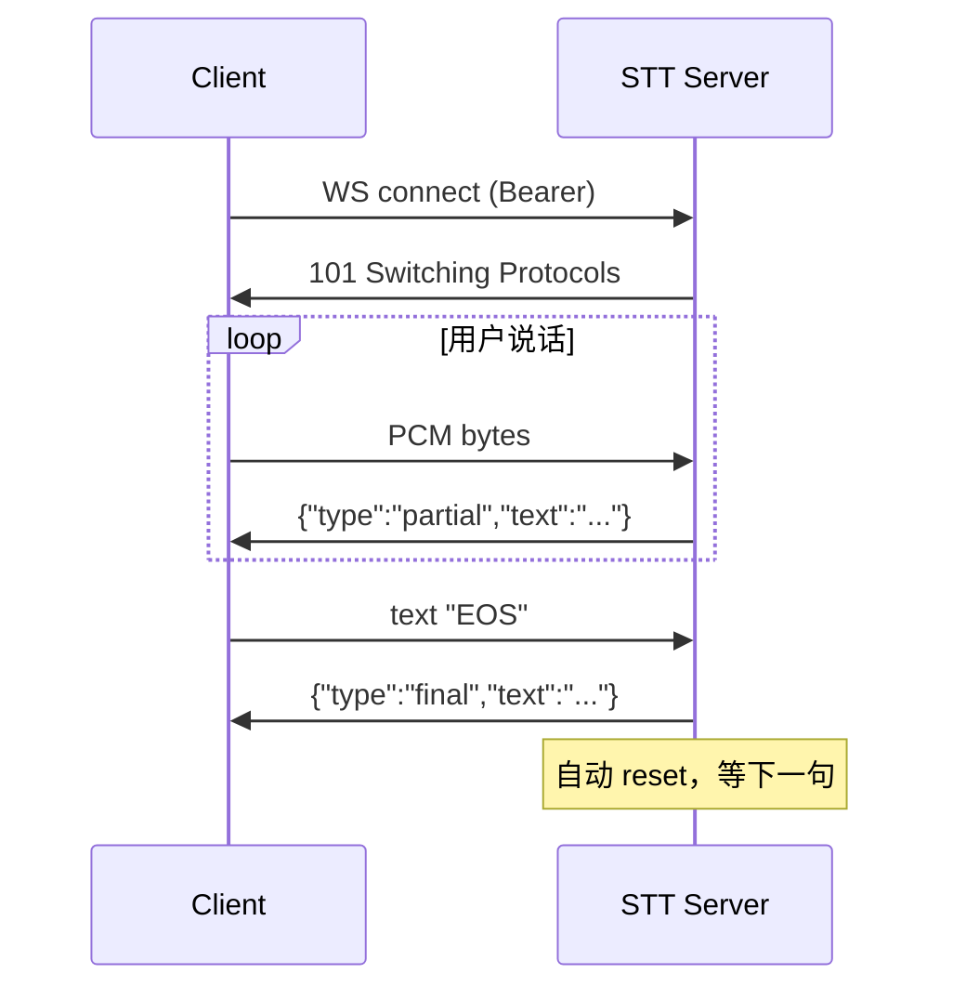
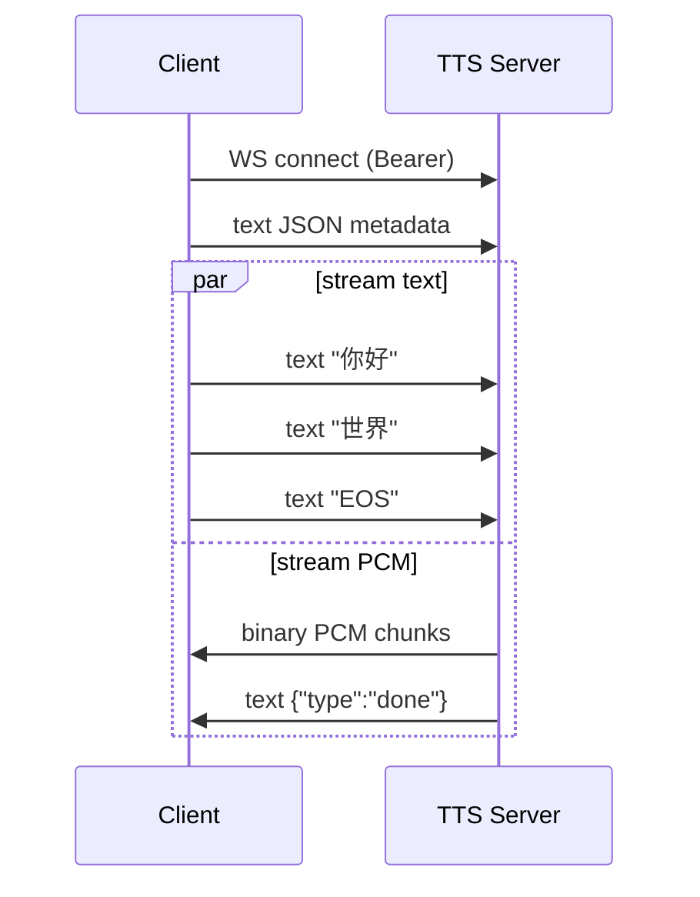

# SP1.5 API 规范 + OpenAPI + endpoint refactor Implementation Plan

> **For agentic workers:** REQUIRED SUB-SKILL: Use superpowers:subagent-driven-development (recommended) or superpowers:executing-plans to implement this plan task-by-task. Steps use checkbox (`- [ ]`) syntax for tracking.

**Goal:** 把 RTVoice 4 个服务的 endpoints hard cutover 到 `/v1/` 前缀 + 统一错误格式 `{type,code,message,request_id}` + 写完整 API 规范文档（CONVENTIONS.md + per-service docs）+ FastAPI auto-OpenAPI 加 summary/responses 元信息。

**Architecture:** Per-service `app/error_schema.py` 模块定义 `ErrorResponse` Pydantic + `api_error()` helper；FastAPI exception handler 统一返新 schema。Endpoint 路径改加 `/v1/` 前缀（数据面）；老路径 hard 删除（CozyVoice 未接入，无外部 consumer）。Agent-worker 客户端同步改 URL。

**Tech Stack:** FastAPI / Pydantic v2 / Markdown / Mermaid / git。

**Spec:** [docs/superpowers/specs/2026-05-08-sp1.5-api-conventions-design.md](../specs/2026-05-08-sp1.5-api-conventions-design.md)

---

## Task 1: 写 CONVENTIONS.md

**Files:**
- Create: `docs/api/CONVENTIONS.md`

- [ ] **Step 1: 创建 docs/api/ 目录（如不存在）**

```bash
cd /home/ubuntu/CozyProjects/RTVoice
mkdir -p docs/api
```

- [ ] **Step 2: 写完整 CONVENTIONS.md**

把以下内容**完整覆盖**到 `docs/api/CONVENTIONS.md`:

````markdown
# RTVoice API Conventions

本文档是 RTVoice 平台 API 的**规范**：路径风格、版本、错误格式、鉴权、headers、capability discovery、deprecation 流程。
所有 service（STT / TTS / token-server / Realtime Voice）必须遵守。

> **快速速查**：[§2 速查表](#速查表)

---

## §1 基础原则

- 数据面 endpoints 用 `/v1/<resource>` 前缀
- 运维面 (`/health`、`/metrics`、`/info`、`/openapi.json`) **不**加版本前缀
- HTTP + WS 错误格式同形态：`{"type":"error","code":"...","message":"...","request_id":"..."}`
- 客户端 Bearer token 鉴权；admin 端单独 key
- breaking change 走 soft deprecation（≥1 release + Deprecation/Sunset headers）

## §2 速查表

| 项 | 规则 |
|---|---|
| URL 前缀 | 数据面 `/v1/`，运维面无版本 |
| 资源命名 | 复数名词（`/voices`、`/sessions`），snake_case 路径参数（`{spk_id}`）|
| 动词 | URL 不放动词，用 HTTP method 语义 |
| 错误格式 | `{type:"error", code:"<service>.<reason>", message, request_id}` |
| 鉴权 | HTTP `Authorization: Bearer`；WS 三路（header / subprotocol / query）|
| Status Code | 200/201/204 成功；400/401/403/404/409/410/422/429/503 各定语义 |
| Request ID | 客户端可传 `X-Request-ID`，server 必返 |
| Pagination | cursor + limit |

---

## §3 URL 与命名

- 资源用复数：`/voices`（collection），`/voices/{spk_id}`（item）
- snake_case for 多词资源和路径参数：`/v1/tts/stream`、`/v1/tts/stream_ws`、`{spk_id}`、`{session_id}`
- **禁止动词在 URL 中**：`POST /voices/add` ❌ → `POST /voices` ✓（创建动作由 POST method 表达）
- 子资源用斜杠分隔：`/v1/sessions/{id}/transcript`

## §4 HTTP 方法语义

| 方法 | 语义 | 幂等 |
|---|---|---|
| GET | 读取，无副作用 | ✓ |
| POST | 创建 / 触发动作 | ✗ |
| PUT | 全量替换 | ✓ |
| PATCH | 部分更新 | ✗ |
| DELETE | 删除 | ✓ |

## §5 HTTP Status Codes

| Code | 用途 |
|---|---|
| 200 | 同步成功 |
| 201 | 创建成功（POST 返新资源）|
| 204 | 成功无 body（DELETE）|
| 400 | 参数错误（schema 不对）|
| 401 | 鉴权失败 / 缺 Bearer |
| 403 | Bearer 对但无权限 |
| 404 | 资源不存在 |
| 409 | 冲突（如 spk_id 重复）|
| 410 | 资源永久删除（deprecated endpoint sunset 后）|
| 422 | 业务校验失败（如 wav 格式不对）|
| 429 | rate limit |
| 503 | 服务未就绪（model loading）|

## §6 错误格式

所有 4xx/5xx 响应 body：

```json
{
  "type": "error",
  "code": "tts.voice_not_found",
  "message": "voice 'unknown' 不存在",
  "request_id": "req_abc123"
}
```

`code` 用 `<service>.<reason>` 分层 snake_case：

| 范例 | 含义 |
|---|---|
| `stt.invalid_audio` | STT 收到非 PCM int16 LE 16kHz |
| `tts.voice_not_found` | TTS 未知 spk_id |
| `tts.voice_already_exists` | 重复注册音色 |
| `tts.wav_too_large` | 上传 wav > 5MB |
| `auth.invalid_token` | Bearer 不对 |
| `auth.missing_token` | 没传 Bearer |
| `session.not_found` | session_id 不存在 |
| `internal.unknown` | 兜底（不详的内部异常）|

WS 错误事件用同 schema：`{"type":"error","code":"...","message":"..."}`。

## §7 鉴权

### HTTP

```
Authorization: Bearer <RTVOICE_API_KEY>
```

`RTVOICE_API_KEY` 留空时 service 在 dev 模式跳过鉴权（仅 dev compose profile）。

### WebSocket（三路任一即可）

| 方式 | 写法 | 适用 |
|---|---|---|
| HTTP header | `Authorization: Bearer <KEY>` | server-to-server |
| subprotocol | `Sec-WebSocket-Protocol: bearer.<KEY>` | 浏览器（标准 ws subprotocol）|
| query | `?token=<KEY>` | 兜底 |

鉴权失败：HTTP 401 / WS close code `4401`。

### Admin endpoints

`POST /v1/voices`、`DELETE /v1/voices/{id}` 用单独的 `TTS_ADMIN_API_KEY`（不是 RTVOICE_API_KEY），避免 client key 被滥用为管理权限。

## §8 通用 Headers

| Header | 方向 | 用途 |
|---|---|---|
| `Authorization` | request | Bearer token |
| `Content-Type` | request | `application/json` 默认 |
| `X-Request-ID` | request/response | 客户端可传，server 必返；用于排障关联 |
| `Deprecation` | response | `true` if endpoint 即将下线 |
| `Sunset` | response | RFC 7231 HTTP date，endpoint 下线日期 |
| `RateLimit-Limit` | response | 限流上限（每分钟）|
| `RateLimit-Remaining` | response | 当前窗口剩余 |

## §9 Pagination

未来 list endpoints 用 cursor 分页：

```
GET /v1/voices?cursor=<opaque>&limit=50
→ {"data": [...], "next_cursor": "..." | null}
```

理由：offset pagination 在 high-throughput insert 下结果不稳；cursor 提前定，避免后续 v2 时再换。

## §10 Capability Discovery

每个 service 暴露：

- `GET /info` — 简单 JSON `{name, version, backend, capabilities: {...}}`
- `GET /openapi.json` — FastAPI auto-generated OpenAPI 3.0 schema

WS endpoints 在 `docs/api/{service}.md` 用 markdown 描述（OpenAPI 3.0 对 WS 支持弱，未来如必要再考虑 AsyncAPI）。

## §11 OpenAPI 自动生成约定

每 endpoint 必须：

1. 用 Pydantic models 描述 request body / response
2. `summary` + `description` + `tags`
3. `responses={200: ..., 400: ..., 401: ..., ...}` 标注错误返回（用本规范的 `ErrorResponse` model）

例:

```python
@app.post(
    "/v1/voices",
    summary="Register a new voice clone",
    description="Upload 16kHz mono wav (3-30s) + reference text. Persists.",
    tags=["voices"],
    response_model=VoiceCreated,
    status_code=201,
    responses={
        400: {"model": ErrorResponse, "description": "Invalid input"},
        401: {"model": ErrorResponse, "description": "Auth failed"},
        409: {"model": ErrorResponse, "description": "spk_id exists"},
    },
)
async def add_voice(...): ...
```

## §12 Deprecation 流程（未来 breaking change 模板）

1. 新 endpoint 上线（如 `/v2/foo`）
2. 老 endpoint `/v1/foo` 仍工作，response 加：
   - `Deprecation: true`
   - `Sunset: Thu, 31 Dec 2026 23:59:59 GMT`
3. CHANGELOG 公告 + 文档加 `**deprecated**` 标记
4. ≥ 1 个 release 周期后，老 endpoint 返 410 Gone：
   ```json
   {"type":"error","code":"deprecated","message":"endpoint moved to /v2/foo, see Sunset header"}
   ```

## §13 现有 endpoints 迁移表（v0.7 → v0.8 hard cutover）

| 老路径 | 新路径 | 备注 |
|---|---|---|
| `WS /asr` | `WS /v1/asr` | STT |
| `POST /tts/stream` | `POST /v1/tts/stream` | TTS HTTP |
| `WS /tts/stream_ws` | `WS /v1/tts/stream_ws` | TTS WS |
| `GET /voices` | `GET /v1/voices` | TTS list |
| `POST /voices/add` | `POST /v1/voices` | **方法换 POST + 去掉 /add**（不放动词在 URL）|
| `DELETE /voices/{spk_id}` | `DELETE /v1/voices/{spk_id}` | TTS delete |
| `POST /token` | `POST /v1/tokens` | token-server，**复数化** |
| 新增 | `POST /v1/sessions` | Realtime Voice 创建 session（SP2 实现）|
| 新增 | `WS /v1/realtime/{session_id}` | Realtime Voice 数据面（SP2 实现）|

**保留不动**（运维 / 内部测试页）：

- `GET /health` 所有 service
- `GET /metrics` 所有 service
- `GET /info` stt-server, tts-server
- `GET /openapi.json` 所有 FastAPI app（auto）
- token-server `GET /` 测试页（dev 用）
````

- [ ] **Step 3: 验证文件**

```bash
wc -l docs/api/CONVENTIONS.md
grep -c '^## §' docs/api/CONVENTIONS.md
```

Expected: ≥ 200 行；`## §` 章节数 13。

- [ ] **Step 4: Commit**

```bash
git add docs/api/CONVENTIONS.md
git commit -m "docs(api): CONVENTIONS.md (SP1.5 T1)

13 章节 API 规范：基础原则 / 速查表 / URL 命名 / HTTP 方法 /
status codes / 错误格式 / 鉴权（HTTP+WS 三路）/ headers / pagination /
capability discovery / OpenAPI 约定 / deprecation 流程 /
现有 endpoints 迁移表"
```

---

## Task 2: STT-server endpoint refactor

**Files:**
- Create: `services/stt-server/app/error_schema.py`
- Modify: `services/stt-server/app/main.py`

- [ ] **Step 1: 创建 error_schema.py**

文件 `services/stt-server/app/error_schema.py`:

```python
"""统一错误响应 Pydantic schema + helper（per-service copy；与 CONVENTIONS.md §6 一致）"""

from typing import Literal
from fastapi import HTTPException, Request
from fastapi.responses import JSONResponse
from pydantic import BaseModel


class ErrorResponse(BaseModel):
    type: Literal["error"] = "error"
    code: str
    message: str
    request_id: str | None = None


def api_error(status: int, code: str, message: str) -> HTTPException:
    """raise api_error(404, 'stt.not_found', 'X')"""
    e = HTTPException(status_code=status, detail=message)
    e.error_code = code
    return e


def http_exception_handler():
    """returns FastAPI exception handler that uses ErrorResponse schema"""
    async def handler(request: Request, exc: HTTPException):
        return JSONResponse(
            status_code=exc.status_code,
            content={
                "type": "error",
                "code": getattr(exc, "error_code", "internal.unknown"),
                "message": str(exc.detail),
                "request_id": request.headers.get("X-Request-ID"),
            },
        )
    return handler
```

- [ ] **Step 2: 改 main.py imports**

在 `services/stt-server/app/main.py` 顶部加 import:

```python
from app.error_schema import ErrorResponse, api_error, http_exception_handler
```

- [ ] **Step 3: 改 main.py path**

把 `@app.websocket("/asr")` 改为 `@app.websocket("/v1/asr")`。用 Edit tool 替换那一行。

- [ ] **Step 4: 注册 exception handler**

在 `app = FastAPI(...)` 创建后立即加：

```python
app.add_exception_handler(HTTPException, http_exception_handler())
```

- [ ] **Step 5: 验证 stt-server 可启动（沙盒 mock test）**

```bash
cd services/stt-server
python3 -c "
import sys, types
# mock sherpa_onnx
sh = types.ModuleType('sherpa_onnx')
sh.OnlineRecognizer = type('R', (), {'from_paraformer': staticmethod(lambda **kw: None), 'from_transducer': staticmethod(lambda **kw: None)})
sys.modules['sherpa_onnx'] = sh
inst = types.ModuleType('prometheus_fastapi_instrumentator')
inst.Instrumentator = type('I', (), {'__init__': lambda self, **kw: None, 'instrument': lambda self, app: self, 'expose': lambda self, app: None})
sys.modules['prometheus_fastapi_instrumentator'] = inst
import os
os.environ['STT_MODELS_DIR'] = '/tmp/x'
sys.path.insert(0, '.')
from app.main import app
routes = [r.path for r in app.routes if hasattr(r, 'path')]
assert '/v1/asr' in routes, f'missing /v1/asr in {routes}'
assert '/asr' not in routes, f'old /asr still present: {routes}'
print('routes ok:', sorted(routes))
"
```

Expected: 输出 routes 含 `/v1/asr`、`/health`、`/info`、`/metrics`，不含老 `/asr`。

- [ ] **Step 6: Commit**

```bash
cd /home/ubuntu/CozyProjects/RTVoice
git add services/stt-server/app/error_schema.py services/stt-server/app/main.py
git commit -m "refactor(stt-server): /asr → /v1/asr + ErrorResponse schema (SP1.5 T2)

- /asr → /v1/asr hard cutover
- error_schema.py 加 ErrorResponse + api_error() + http_exception_handler()
- HTTPException 全部走统一 {type,code,message,request_id} 格式
- 沙盒 mock test 验证 /v1/asr 路径生效"
```

---

## Task 3: TTS-server endpoint refactor (3 main_*.py 文件)

**Files:**
- Create: `services/tts-server/app/error_schema.py`
- Modify: `services/tts-server/app/main.py` (Kokoro)
- Modify: `services/tts-server/app/main_cosyvoice.py` (v0.6 v2)
- Modify: `services/tts-server/app/main_cosyvoice3.py` (v0.7 v3)

- [ ] **Step 1: 创建 error_schema.py**（与 stt-server 同款，per-service copy）

`services/tts-server/app/error_schema.py`：

```python
"""统一错误响应 Pydantic schema + helper（与 CONVENTIONS.md §6 一致）"""

from typing import Literal
from fastapi import HTTPException, Request
from fastapi.responses import JSONResponse
from pydantic import BaseModel


class ErrorResponse(BaseModel):
    type: Literal["error"] = "error"
    code: str
    message: str
    request_id: str | None = None


def api_error(status: int, code: str, message: str) -> HTTPException:
    e = HTTPException(status_code=status, detail=message)
    e.error_code = code
    return e


def http_exception_handler():
    async def handler(request: Request, exc: HTTPException):
        return JSONResponse(
            status_code=exc.status_code,
            content={
                "type": "error",
                "code": getattr(exc, "error_code", "internal.unknown"),
                "message": str(exc.detail),
                "request_id": request.headers.get("X-Request-ID"),
            },
        )
    return handler
```

- [ ] **Step 2: 改 main_cosyvoice3.py**

加 import:
```python
from app.error_schema import ErrorResponse, api_error, http_exception_handler
```

把以下路径改为 `/v1/...`（用 Edit tool 各替换一处）:

| 老 | 新 |
|---|---|
| `@app.get("/voices")` | `@app.get("/v1/voices")` |
| `@app.post("/tts/stream")` | `@app.post("/v1/tts/stream")` |
| `@app.websocket("/tts/stream_ws")` | `@app.websocket("/v1/tts/stream_ws")` |
| `@app.post("/voices/add")` | `@app.post("/v1/voices", status_code=201)` |
| `@app.delete("/voices/{spk_id}")` | `@app.delete("/v1/voices/{spk_id}")` |

注意：原 `@app.exception_handler(HTTPException)` 自定义 handler 已经返 `{"error": ...}` 旧格式，现在替换为 `http_exception_handler()`。

找到原 handler:
```python
@app.exception_handler(HTTPException)
async def _http_exc(request: Request, exc: HTTPException):
    return JSONResponse(status_code=exc.status_code, content={"error": exc.detail})
```

替换为:
```python
app.add_exception_handler(HTTPException, http_exception_handler())
```

放在 `app = FastAPI(...)` 之后即可。删除原 `_http_exc` 函数。

把 `raise HTTPException(status_code=N, detail="...")` 调用换为 `raise api_error(N, "<service.code>", "...")`，主要这几处：

- `raise HTTPException(503, "CosyVoice 尚未加载")` → `raise api_error(503, "tts.not_ready", "CosyVoice 尚未加载")`
- `raise HTTPException(403, "admin endpoints disabled (TTS_ADMIN_API_KEY 未设置)")` → `raise api_error(403, "auth.admin_disabled", "admin endpoints disabled (TTS_ADMIN_API_KEY 未设置)")`
- `raise HTTPException(401, "invalid or missing Bearer token")` → `raise api_error(401, "auth.invalid_token", "invalid or missing Bearer token")`
- `raise HTTPException(400, "spk_id 只允许字母数字下划线/中日韩字符/连字符，长度 1-64")` → `raise api_error(400, "tts.invalid_spk_id", "...")`
- `raise HTTPException(409, f"音色 {spk_id!r} 已存在；先 DELETE 再 POST")` → `raise api_error(409, "tts.voice_already_exists", ...)`
- `raise HTTPException(400, f"未知音色 voice={req.voice!r} → {voice!r}; 可用={_cosyvoice_voices}")` → `raise api_error(400, "tts.voice_not_found", ...)`
- `raise HTTPException(400, "默认音色 ... 不可删除")` → `raise api_error(400, "tts.default_voice_protected", ...)`
- `raise HTTPException(404, f"音色 {spk_id!r} 不存在")` → `raise api_error(404, "tts.voice_not_found", ...)`
- `raise HTTPException(413, ...)` → `raise api_error(413, "tts.wav_too_large", ...)`
- `raise HTTPException(400, "wav 文件过小，疑似无效")` → `raise api_error(400, "tts.invalid_wav", ...)`
- `raise HTTPException(400, f"wav 解码失败：...")` → `raise api_error(400, "tts.wav_decode_failed", ...)`

用 grep 找全:

```bash
grep -n "HTTPException(" services/tts-server/app/main_cosyvoice3.py
```

把每行换成对应 `api_error()`。

- [ ] **Step 3: 改 main_cosyvoice.py**（v0.6 v2 同样改动）

重复 Step 2 同样 5 个路径替换 + 同样 exception handler 替换 + 同样 raise 改 api_error。code 用 `tts.*` 即可。

注意 `main_cosyvoice.py` 没有 WS endpoint，只有 4 处路径要改：`/voices` `/tts/stream` `/voices/add` `/voices/{spk_id}`。

- [ ] **Step 4: 改 main.py（Kokoro CPU 版本）**

文件 `services/tts-server/app/main.py`。同样 4 处路径替换（无 WS）+ exception handler。

- [ ] **Step 5: 沙盒 mock test 验证 3 个 main_*.py 路径生效**

```bash
cd /home/ubuntu/CozyProjects/RTVoice/services/tts-server
python3 -c "
import sys, types, os

# mocks
for n in ('torch','torchaudio','numpy','prometheus_fastapi_instrumentator'):
    sys.modules.setdefault(n, types.ModuleType(n))
sys.modules['prometheus_fastapi_instrumentator'].Instrumentator = type('I', (), {'__init__': lambda s,**k: None, 'instrument': lambda s,a: s, 'expose': lambda s,a: None})
sys.modules['torch'].Tensor = object
sys.modules['torch'].int16 = 'int16'
class FakeWave:
    shape = (1, 48000)
sys.modules['torchaudio'].load = lambda p: (FakeWave(), 16000)

cosy_pkg = types.ModuleType('cosyvoice'); cli = types.ModuleType('cosyvoice.cli'); m = types.ModuleType('cosyvoice.cli.cosyvoice')
class FakeCosy:
    def __init__(self, *a, **kw): self._spk = {'default_zh_female': {}}
    def list_available_spks(self): return list(self._spk)
m.CosyVoice2 = FakeCosy; m.CosyVoice3 = FakeCosy
sys.modules['cosyvoice'] = cosy_pkg; sys.modules['cosyvoice.cli'] = cli; sys.modules['cosyvoice.cli.cosyvoice'] = m

ko = types.ModuleType('kokoro_onnx')
class FakeKokoro:
    def __init__(self, *a, **kw): pass
    def get_voices(self): return ['zf_xiaobei']
ko.Kokoro = FakeKokoro
sys.modules['kokoro_onnx'] = ko

from pathlib import Path
Path('/tmp/fake_v3/Fun-CosyVoice3-0.5B-2512').mkdir(parents=True, exist_ok=True)
(Path('/tmp/fake_v3/Fun-CosyVoice3-0.5B-2512')/'llm.pt').touch()
Path('/tmp/fake_cosy/asset').mkdir(parents=True, exist_ok=True)
(Path('/tmp/fake_cosy/asset')/'zero_shot_prompt.wav').write_bytes(b'RIFF'+b'x'*200)
Path('/tmp/fake_kokoro').mkdir(exist_ok=True)
(Path('/tmp/fake_kokoro')/'kokoro-v1.0.onnx').touch()
(Path('/tmp/fake_kokoro')/'voices-v1.0.bin').touch()

os.environ['MODEL_DIR'] = '/tmp/fake_v3/Fun-CosyVoice3-0.5B-2512'
os.environ['COSYVOICE_DIR'] = '/tmp/fake_cosy'
os.environ['TTS_MODELS_DIR'] = '/tmp/fake_kokoro'

sys.path.insert(0, '.')

# Test main_cosyvoice3
for mod_name in ['app.main', 'app.main_cosyvoice', 'app.main_cosyvoice3']:
    if mod_name in sys.modules: del sys.modules[mod_name]
    try:
        m = __import__(mod_name, fromlist=['app'])
        routes = [r.path for r in m.app.routes if hasattr(r, 'path')]
        assert '/v1/tts/stream' in routes, f'{mod_name}: missing /v1/tts/stream in {routes}'
        assert '/v1/voices' in routes, f'{mod_name}: missing /v1/voices'
        assert '/tts/stream' not in routes, f'{mod_name}: old /tts/stream still in {routes}'
        assert '/voices/add' not in routes, f'{mod_name}: old /voices/add still in {routes}'
        if mod_name == 'app.main_cosyvoice3':
            assert '/v1/tts/stream_ws' in routes, f'missing v3 ws path'
        print(f'{mod_name}: routes ok')
    except Exception as e:
        print(f'{mod_name}: FAILED {e}')
        raise
"
```

Expected: 3 个 module 都打印 `routes ok`，无 FAILED。

- [ ] **Step 6: Commit**

```bash
cd /home/ubuntu/CozyProjects/RTVoice
git add services/tts-server/app/error_schema.py services/tts-server/app/main.py services/tts-server/app/main_cosyvoice.py services/tts-server/app/main_cosyvoice3.py
git commit -m "refactor(tts-server): /v1/ 前缀 + POST /v1/voices + ErrorResponse (SP1.5 T3)

3 个 main_*.py 文件（Kokoro / CosyVoice2 / CosyVoice3）同步改动：
- /tts/stream → /v1/tts/stream
- /tts/stream_ws → /v1/tts/stream_ws (仅 v3)
- /voices → /v1/voices
- POST /voices/add → POST /v1/voices (RESTful collection)
- DELETE /voices/{spk_id} → DELETE /v1/voices/{spk_id}
- error_schema.py 加 ErrorResponse + api_error()
- HTTPException 全部带 error_code (tts.voice_not_found 等)
- 沙盒 mock test 验证 3 个 module 路径生效"
```

---

## Task 4: token-server endpoint refactor + test_page.html

**Files:**
- Create: `services/token-server/app/error_schema.py`
- Modify: `services/token-server/app/main.py`
- Modify: `services/token-server/test_page.html`

- [ ] **Step 1: 创建 error_schema.py**

`services/token-server/app/error_schema.py`（同款 copy，与上面 STT/TTS 一字不差）。

```python
"""统一错误响应 Pydantic schema + helper（与 CONVENTIONS.md §6 一致）"""

from typing import Literal
from fastapi import HTTPException, Request
from fastapi.responses import JSONResponse
from pydantic import BaseModel


class ErrorResponse(BaseModel):
    type: Literal["error"] = "error"
    code: str
    message: str
    request_id: str | None = None


def api_error(status: int, code: str, message: str) -> HTTPException:
    e = HTTPException(status_code=status, detail=message)
    e.error_code = code
    return e


def http_exception_handler():
    async def handler(request: Request, exc: HTTPException):
        return JSONResponse(
            status_code=exc.status_code,
            content={
                "type": "error",
                "code": getattr(exc, "error_code", "internal.unknown"),
                "message": str(exc.detail),
                "request_id": request.headers.get("X-Request-ID"),
            },
        )
    return handler
```

- [ ] **Step 2: 改 token-server main.py path**

```bash
grep -n '@app.post(' services/token-server/app/main.py
```

找到 `@app.post("/token", ...)` 行，改为：
```python
@app.post("/v1/tokens", ...)
```

注意 `/token` → `/v1/tokens`（**单数变复数**）。

- [ ] **Step 3: 改 raise HTTPException 为 api_error**

找:
```bash
grep -n "HTTPException(" services/token-server/app/main.py
```

把每个 `HTTPException(...)` 换成 `api_error(...)` 配对。code 用 `auth.*` 或 `token.*` 前缀（如 `auth.missing_token`、`auth.invalid_token`）。

加 imports + exception handler 注册（同 STT pattern）：

```python
from app.error_schema import ErrorResponse, api_error, http_exception_handler

# 在 app = FastAPI(...) 之后
app.add_exception_handler(HTTPException, http_exception_handler())
```

删除原有自定义 exception handler（如有）。

- [ ] **Step 4: 改 test_page.html**

```bash
grep -n '/token' services/token-server/test_page.html
```

找到所有 `'/token'` 字符串引用（应在 fetch / XHR 调用里），替换为 `'/v1/tokens'`。

如：
```javascript
fetch('/token', { ... })
```
→
```javascript
fetch('/v1/tokens', { ... })
```

- [ ] **Step 5: 沙盒 mock test 验证**

```bash
cd /home/ubuntu/CozyProjects/RTVoice/services/token-server
python3 -c "
import sys, types
inst = types.ModuleType('prometheus_fastapi_instrumentator')
inst.Instrumentator = type('I', (), {'__init__': lambda s,**k: None, 'instrument': lambda s,a: s, 'expose': lambda s,a: None})
sys.modules['prometheus_fastapi_instrumentator'] = inst
slowapi = types.ModuleType('slowapi')
slowapi.Limiter = type('L', (), {'__init__': lambda s, **k: None})
slowapi._rate_limit_exceeded_handler = lambda *a, **k: None
sys.modules['slowapi'] = slowapi
slowapi_util = types.ModuleType('slowapi.util'); slowapi_util.get_remote_address = lambda r: '127.0.0.1'
sys.modules['slowapi.util'] = slowapi_util
slowapi_errors = types.ModuleType('slowapi.errors'); slowapi_errors.RateLimitExceeded = type('R', (Exception,), {})
sys.modules['slowapi.errors'] = slowapi_errors
import os
os.environ['LIVEKIT_API_KEY'] = 'k'
os.environ['LIVEKIT_API_SECRET'] = 's'
os.environ['APP_API_KEY'] = 'a' * 32
sys.path.insert(0, '.')
from app.main import app
routes = [r.path for r in app.routes if hasattr(r, 'path')]
assert '/v1/tokens' in routes, f'missing /v1/tokens in {routes}'
assert '/token' not in routes, f'old /token still in {routes}'
print('token-server routes ok:', sorted(routes))
"
```

- [ ] **Step 6: Commit**

```bash
cd /home/ubuntu/CozyProjects/RTVoice
git add services/token-server/app/error_schema.py services/token-server/app/main.py services/token-server/test_page.html
git commit -m "refactor(token-server): POST /token → POST /v1/tokens (SP1.5 T4)

- /token → /v1/tokens（单数 → 复数化，与 RESTful 一致）
- error_schema.py 加 ErrorResponse + api_error()
- test_page.html JS fetch URL 同步改
- HTTPException 走统一 {type,code,message,request_id} 格式"
```

---

## Task 5: agent-worker client URL 更新

**Files:**
- Modify: `services/agent-worker/app/main.py`
- Modify: `services/agent-worker/app/tts_client.py`

- [ ] **Step 1: 改 main.py env 默认值**

文件 `services/agent-worker/app/main.py`，找到:

```python
STT_WS_URL = os.environ.get("STT_WS_URL", "ws://stt-server:9090/asr")
```

改为:

```python
STT_WS_URL = os.environ.get("STT_WS_URL", "ws://stt-server:9090/v1/asr")
```

`TTS_BASE_URL` 不变（base URL，不含 path）。

- [ ] **Step 2: 改 tts_client.py path 拼接**

文件 `services/agent-worker/app/tts_client.py`，找:

```bash
grep -n '/tts/stream\|/voices\|/info' services/agent-worker/app/tts_client.py
```

把所有 `/tts/stream` → `/v1/tts/stream`；`/tts/stream_ws` → `/v1/tts/stream_ws`；`/info`（capability discovery）保持不变（运维面）；其他 hardcoded path 同步加 `/v1/`。

具体路径出现位置：
- `f"{self.base_url}/tts/stream"` → `f"{self.base_url}/v1/tts/stream"`
- `ws_url = ... + '/tts/stream_ws'` → `... + '/v1/tts/stream_ws'`
- `f'{self.base_url}/info'` → 不变（运维面）

- [ ] **Step 3: docker-compose.yml 默认值同步**

```bash
grep -n 'STT_WS_URL\|TTS_BASE_URL' docker-compose.yml
```

如果 docker-compose.yml 显式 set 了 `STT_WS_URL: ws://stt-server:9090/asr`，改为 `ws://stt-server:9090/v1/asr`。`TTS_BASE_URL` 不变。

如果未显式 set（agent-worker code 的 default 已改），跳过此 step。

- [ ] **Step 4: 沙盒 syntax 验证**

```bash
python3 -c "
import ast
ast.parse(open('services/agent-worker/app/main.py').read())
ast.parse(open('services/agent-worker/app/tts_client.py').read())
print('OK syntax')
"
```

- [ ] **Step 5: Commit**

```bash
git add services/agent-worker/app/main.py services/agent-worker/app/tts_client.py docker-compose.yml
git commit -m "refactor(agent-worker): client URL 改 /v1/ (SP1.5 T5)

- main.py STT_WS_URL 默认值 /asr → /v1/asr
- tts_client.py hardcoded /tts/stream /tts/stream_ws → /v1/...
- /info 保持原路径（运维面无版本）"
```

---

## Task 6: 写 docs/api/stt.md

**Files:**
- Create: `docs/api/stt.md`

- [ ] **Step 1: 写 docs/api/stt.md**

```markdown
# STT Service API

> 实时流式语音识别。sherpa-onnx Streaming Zipformer 中英文。

## Endpoints 速查

| 用途 | 方法 | 路径 | 鉴权 |
|---|---|---|---|
| 流式识别 | WS | `/v1/asr` | Bearer |
| 健康检查 | GET | `/health` | 无 |
| 服务信息 | GET | `/info` | 无 |
| OpenAPI schema | GET | `/openapi.json` | 无 |
| Prometheus 指标 | GET | `/metrics` | 无 |

## WS /v1/asr

### 鉴权

三路任一（详见 [CONVENTIONS.md §7](./CONVENTIONS.md#§7-鉴权)）：
- Header: `Authorization: Bearer <RTVOICE_API_KEY>`
- Subprotocol: `Sec-WebSocket-Protocol: bearer.<KEY>`
- Query: `?token=<KEY>`

### Client → Server messages

| Type | Payload | 何时发 |
|---|---|---|
| binary | PCM int16 LE 16kHz mono samples | 持续，建议 20-100ms 一帧 |
| text `"EOS"` | — | 用户发言结束，触发 final |
| text `"RESET"` | — | 丢弃当前 stream（一般不必，server 在 final 后自动 reset）|

### Server → Client messages (JSON events)

| Type | Schema | 时机 |
|---|---|---|
| `{"type":"partial","text":"..."}` | partial 转写 | streaming 中持续 |
| `{"type":"final","text":"..."}` | final 转写 | 收到 EOS 或 endpoint 触发后 |
| `{"type":"error","code":"...","message":"..."}` | 错误 | 失败时 |

### State diagram



### 常见 error codes

| Code | HTTP/WS close code | 含义 |
|---|---|---|
| `auth.invalid_token` | WS 4401 | Bearer 不对 |
| `stt.invalid_audio` | WS 4400 | PCM 格式不对（非 16kHz / 非 int16 LE / 非 mono）|
| `internal.unknown` | WS 1011 | server 异常，看 log |

### Try it (Python)

```python
import asyncio, json, websockets

async def transcribe(pcm_bytes: bytes, api_key: str) -> str:
    async with websockets.connect(
        "ws://localhost:9090/v1/asr",
        additional_headers={"Authorization": f"Bearer {api_key}"},
    ) as ws:
        # 切 100ms 帧
        chunk_size = 16000 * 2 // 10
        for i in range(0, len(pcm_bytes), chunk_size):
            await ws.send(pcm_bytes[i:i+chunk_size])
        await ws.send("EOS")
        async for msg in ws:
            ev = json.loads(msg)
            if ev["type"] == "final":
                return ev["text"]
        return ""

# 用法
text = asyncio.run(transcribe(open("u.pcm","rb").read(), "your-key"))
```

### Try it (Node)

```js
import WebSocket from 'ws';
import fs from 'fs';

const ws = new WebSocket('ws://localhost:9090/v1/asr', {
  headers: { Authorization: `Bearer ${process.env.RTVOICE_API_KEY}` }
});
ws.on('open', () => {
  const pcm = fs.readFileSync('u.pcm');
  for (let i = 0; i < pcm.length; i += 3200) ws.send(pcm.slice(i, i+3200));
  ws.send('EOS');
});
ws.on('message', d => {
  const ev = JSON.parse(d.toString());
  if (ev.type === 'final') { console.log(ev.text); ws.close(); }
});
```

## GET /info

返:
```json
{
  "name": "stt-server",
  "version": "0.8.0",
  "capabilities": {
    "streaming": true,
    "sample_rate": 16000,
    "channels": 1,
    "model": "sherpa-onnx-streaming-zipformer-bilingual-zh-en"
  }
}
```

## GET /health

返 `{"status":"ok"|"loading"}`，HTTP 200。
```

- [ ] **Step 2: Commit**

```bash
git add docs/api/stt.md
git commit -m "docs(api): docs/api/stt.md (SP1.5 T6)

STT service 完整 API 文档：endpoints 速查表 / WS /v1/asr 协议 /
client+server messages / state diagram / error codes / Python+Node 例子 /
/info schema"
```

---

## Task 7: 写 docs/api/tts.md

**Files:**
- Create: `docs/api/tts.md`

- [ ] **Step 1: 写 docs/api/tts.md**

```markdown
# TTS Service API

> 流式语音合成 + 音色克隆。Fun-CosyVoice 3 (0.5B GPU)（v0.7+）/ Kokoro 82M CPU（v0.5）/ CosyVoice 2 GPU（v0.6）。

## Endpoints 速查

| 用途 | 方法 | 路径 | 鉴权 |
|---|---|---|---|
| HTTP 单次合成 | POST | `/v1/tts/stream` | Bearer |
| WS 双向流式合成（v0.7+）| WS | `/v1/tts/stream_ws` | Bearer |
| 列出音色 | GET | `/v1/voices` | Bearer |
| 注册音色（admin）| POST | `/v1/voices` | TTS_ADMIN_API_KEY |
| 删除音色（admin）| DELETE | `/v1/voices/{spk_id}` | TTS_ADMIN_API_KEY |
| 健康检查 | GET | `/health` | 无 |
| 服务信息 | GET | `/info` | 无 |
| OpenAPI schema | GET | `/openapi.json` | 无 |
| Prometheus 指标 | GET | `/metrics` | 无 |

## POST /v1/tts/stream

### Request

```http
POST /v1/tts/stream HTTP/1.1
Authorization: Bearer <RTVOICE_API_KEY>
Content-Type: application/json

{
  "text": "你好世界",
  "voice": "default_zh_female",
  "speed": 1.0
}
```

### Response

```http
HTTP/1.1 200 OK
Transfer-Encoding: chunked
Content-Type: application/octet-stream
X-Sample-Rate: 24000
X-Channels: 1
X-Format: pcm-int16-le

<chunked PCM bytes>
```

### Body schema

```json
{
  "text": "string (1-2000 字)",
  "voice": "string | null (默认 default_zh_female)",
  "speed": "float 0.5-2.0 (默认 1.0)",
  "lang": "string | null (CosyVoice 自动判语言，可忽略)"
}
```

### Error codes

| Code | HTTP | 含义 |
|---|---|---|
| `auth.invalid_token` | 401 | Bearer 不对 |
| `tts.not_ready` | 503 | model loading，重试 |
| `tts.voice_not_found` | 400 | voice 不存在 |
| `internal.unknown` | 500 | server 异常 |

### Try it

```bash
curl -X POST http://localhost:9880/v1/tts/stream \
  -H "Authorization: Bearer $RTVOICE_API_KEY" \
  -H "Content-Type: application/json" \
  -d '{"text":"你好世界"}' | ffplay -f s16le -ar 24000 -ac 1 -
```

## WS /v1/tts/stream_ws (v0.7+)

双向流式合成：客户端流式发文本，服务端流式返 PCM。延迟 ~150ms 端到端首字节。

### 鉴权

同 STT，三路任一。

### Client → Server messages

| 顺序 | Type | Payload | 说明 |
|---|---|---|---|
| 1 | text (JSON) | `{"voice":"...","speed":1.0}` | metadata 必须首帧 |
| 2..N | text | 文本增量 | 边合成边送 |
| 末 | text `"EOS"` | — | 触发结束 |

### Server → Client messages

| Type | Payload | 时机 |
|---|---|---|
| binary | PCM int16 LE 24kHz mono chunks | 边合成边发 |
| text | `{"type":"done","chunks":N}` | 全部 PCM 发完 |
| text | `{"type":"error","code":"...","message":"..."}` | 失败 |

### State diagram



### Try it (Python)

```python
import asyncio, json, websockets

async def synth_streaming(text_chunks, api_key):
    async with websockets.connect(
        "ws://localhost:9880/v1/tts/stream_ws",
        additional_headers={"Authorization": f"Bearer {api_key}"},
    ) as ws:
        await ws.send(json.dumps({"voice":"default_zh_female","speed":1.0}))
        for chunk in text_chunks:
            await ws.send(chunk)
        await ws.send("EOS")
        async for msg in ws:
            if isinstance(msg, bytes):
                yield msg
            else:
                ev = json.loads(msg)
                if ev["type"] == "done": return
                if ev["type"] == "error":
                    raise RuntimeError(ev["message"])

# 用法
async def main():
    pcm = bytearray()
    async for chunk in synth_streaming(["你好", "世界"], "your-key"):
        pcm.extend(chunk)
    open("out.pcm", "wb").write(pcm)

asyncio.run(main())
```

## GET /v1/voices

返当前注册的音色 ID 列表。

```http
GET /v1/voices
Authorization: Bearer <KEY>

→ {"voices": ["default_zh_female", "alice"]}
```

## POST /v1/voices (admin)

注册新音色 (zero-shot voice clone)。

```http
POST /v1/voices
Authorization: Bearer <TTS_ADMIN_API_KEY>
Content-Type: multipart/form-data

spk_id=alice
prompt_text=参考音频对应的文字（≥3 秒）
file=@reference_16k_mono.wav
```

返:
```json
{"spk_id":"alice","voice_count":2}
```

### Error codes

| Code | HTTP | 含义 |
|---|---|---|
| `auth.admin_disabled` | 403 | TTS_ADMIN_API_KEY 未设置 |
| `auth.invalid_token` | 401 | admin token 不对 |
| `tts.invalid_spk_id` | 400 | spk_id 含非法字符或长度超限 |
| `tts.voice_already_exists` | 409 | spk_id 已存在 |
| `tts.invalid_wav` | 400 | wav 文件过小 / 解码失败 |
| `tts.wav_too_large` | 413 | wav > 5MB |

## DELETE /v1/voices/{spk_id} (admin)

删除自定义音色。默认音色（`default_zh_female`）受保护不可删。

### Error codes

| Code | HTTP | 含义 |
|---|---|---|
| `tts.default_voice_protected` | 400 | 不能删默认 |
| `tts.voice_not_found` | 404 | spk_id 不存在 |

## GET /info

```json
{
  "name": "tts-server",
  "version": "0.8.0",
  "backend": "cosyvoice3",
  "model": "Fun-CosyVoice3-0.5B-2512",
  "capabilities": {
    "streaming": true,
    "voice_clone": true,
    "text_streaming_ws": true,
    "supported_voices": ["default_zh_female"],
    "sample_rate": 24000
  }
}
```
```

- [ ] **Step 2: Commit**

```bash
git add docs/api/tts.md
git commit -m "docs(api): docs/api/tts.md (SP1.5 T7)

TTS service 完整 API 文档：5 个 endpoints / HTTP body schema /
WS 双向流式协议 / state diagrams / error codes / Python curl 例子 /
voice clone admin endpoints / /info schema"
```

---

## Task 8: 写 docs/api/sessions.md (Realtime Voice 占位)

**Files:**
- Create: `docs/api/sessions.md`

- [ ] **Step 1: 写 docs/api/sessions.md**

```markdown
# Realtime Voice Service API

> 实时语音对话。WebSocket gateway 默认（OpenAI Realtime 风格）；LiveKit 高级模式可选。
> **状态：协议骨架 ready；完整实现见 SP2**。

## Endpoints 速查

| 用途 | 方法 | 路径 | 鉴权 | 状态 |
|---|---|---|---|---|
| 创建 session | POST | `/v1/sessions` | Bearer | SP2 |
| WS 数据面 | WS | `/v1/realtime/{session_id}` | session_id | SP2 |
| LiveKit token（高级模式）| POST | `/v1/tokens` | APP_API_KEY | ✓（v0.7）|
| 健康检查 | GET | `/health` | 无 | ✓ |
| 服务信息 | GET | `/info` | 无 | ✓ |

## POST /v1/sessions (SP2 实现)

创建一个 Realtime Voice session：分配 worker、初始化 memory、返回 session_id + ws_url。

### Request

```json
{
  "voice": "default_zh_female",
  "speed": 1.0,
  "prompt": "你是 IT 客服，用中文简短回答",
  "audit_persist": false
}
```

### Response (201 Created)

```json
{
  "session_id": "sess_abc123",
  "ws_url": "ws://localhost:9000/v1/realtime/sess_abc123",
  "expires_at": "2026-05-08T16:30:00Z"
}
```

## WS /v1/realtime/{session_id} (SP2 实现)

双向音频/事件 stream。基于 OpenAI Realtime API events 风格。

### Client → Server

| Type | Payload | 何时 |
|---|---|---|
| text JSON | `{"type":"session.update","instructions":"...","voice":"..."}` | 热改 session config（可选）|
| binary | PCM int16 LE 16kHz mono | 用户音频 |
| text `"audio.eos"` | — | 用户发言结束 |

### Server → Client

| Type | Payload | 时机 |
|---|---|---|
| text | `{"type":"transcript.partial","text":"..."}` | STT partial |
| text | `{"type":"transcript.final","text":"..."}` | STT final |
| text | `{"type":"response.text","text":"..."}` | agent 回复文本（流式）|
| binary | PCM int16 LE 24kHz mono | agent 回复音频 |
| text | `{"type":"response.done"}` | 本轮回复结束 |
| text | `{"type":"error","code":"...","message":"..."}` | 失败 |

详细 session 生命周期 / memory 管理 / prompt 透传规则 → [SP2 设计文档](../superpowers/specs/2026-05-XX-sp2-multi-tenant-session-design.md)（SP2 启动时创建）。

## POST /v1/tokens（高级模式 LiveKit）

发 LiveKit room JWT。仅 LiveKit advanced mode 用；默认 WS gateway 模式不需要。

### Request

```json
{
  "identity": "user-alice",
  "room": "rtvoice-test",
  "ttl_minutes": 10
}
```

### Response

```json
{
  "token": "eyJ...",
  "url": "ws://localhost:7880",
  "room": "rtvoice-test",
  "identity": "user-alice"
}
```

### Error codes

| Code | HTTP | 含义 |
|---|---|---|
| `auth.missing_token` | 401 | 缺 Authorization header |
| `auth.invalid_token` | 401 | APP_API_KEY 不对 |
| `auth.rate_limit` | 429 | 超 rate limit（默认 30/min/IP）|

## GET /info

```json
{
  "name": "token-server",
  "version": "0.8.0",
  "capabilities": {
    "livekit_token": true,
    "rate_limit_per_minute": 30
  }
}
```

## 高级模式 LiveKit 说明

参见 [ARCHITECTURE.md §4](../../ARCHITECTURE.md#§4-realtime-voice-service) 的"LiveKit 高级模式数据流图"。客户端用 [LiveKit 官方 SDK](https://docs.livekit.io/) 而非裸 WebSocket。
```

- [ ] **Step 2: Commit**

```bash
git add docs/api/sessions.md
git commit -m "docs(api): docs/api/sessions.md (SP1.5 T8)

Realtime Voice service API 文档（占位：协议骨架就绪，完整实现 SP2）：
- POST /v1/sessions（SP2 实现）
- WS /v1/realtime/{session_id}（SP2 实现）
- POST /v1/tokens（已有，LiveKit advanced mode）
- 详细 session lifecycle / memory 引用 SP2 spec"
```

---

## Task 9: 跨文档同步更新（README / ARCHITECTURE / OPERATIONS / COZYVOICE_INTEGRATION）

**Files:**
- Modify: `README.md`
- Modify: `ARCHITECTURE.md`
- Modify: `OPERATIONS.md`
- Modify: `COZYVOICE_INTEGRATION.md`

- [ ] **Step 1: README.md 更新 60 秒 try 表 curl**

```bash
sed -i 's|http://127.0.0.1:9880/tts/stream|http://127.0.0.1:9880/v1/tts/stream|g' README.md
```

验证:
```bash
grep "tts/stream" README.md
```

应只出现 `/v1/tts/stream`，无裸 `/tts/stream`。

- [ ] **Step 2: README.md 更新 What's in the box service cards**

每个 service card 里 endpoint 路径要加 `/v1/`:

| 老 | 新 |
|---|---|
| `WS \`/asr\`` | `WS \`/v1/asr\`` |
| `POST \`/tts/stream\`` | `POST \`/v1/tts/stream\`` |
| `WS \`/tts/stream_ws\`` | `WS \`/v1/tts/stream_ws\`` |
| `POST \`/sessions\`` | `POST \`/v1/sessions\`` |
| `WS \`/v1/realtime/{session_id}\`` | 已是 v1，不变 |
| `POST /voices/add` | `POST /v1/voices` |

用 sed 替换:
```bash
sed -i 's|WS `/asr`|WS `/v1/asr`|' README.md
sed -i 's|POST `/tts/stream`|POST `/v1/tts/stream`|' README.md
sed -i 's|WS `/tts/stream_ws`|WS `/v1/tts/stream_ws`|' README.md
sed -i 's|POST `/sessions`|POST `/v1/sessions`|' README.md
sed -i 's|POST /voices/add|POST /v1/voices|' README.md
```

验证 + 检查无遗漏:
```bash
grep -nE "(POST|GET|DELETE|WS)\s+\`?/(asr|tts|voices|sessions|tokens?)" README.md
```

每行结果应都是 `/v1/...`。

- [ ] **Step 3: ARCHITECTURE.md 更新 §2 §3 §4 接口签名段**

文件 `ARCHITECTURE.md` 内有以下需替换:

```bash
sed -i 's|WS /asr|WS /v1/asr|g' ARCHITECTURE.md
sed -i 's|POST /tts/stream|POST /v1/tts/stream|g' ARCHITECTURE.md
sed -i 's|WS /tts/stream_ws|WS /v1/tts/stream_ws|g' ARCHITECTURE.md
sed -i 's|POST /sessions|POST /v1/sessions|g' ARCHITECTURE.md
sed -i 's|WS /v1/realtime|WS /v1/realtime|g' ARCHITECTURE.md  # 已是 v1，no-op safety
sed -i 's|POST /voices/add|POST /v1/voices|g' ARCHITECTURE.md
sed -i 's|/voices/{spk_id}|/v1/voices/{spk_id}|g' ARCHITECTURE.md
sed -i 's|POST /token|POST /v1/tokens|g' ARCHITECTURE.md
```

注意：第二个 `s|WS /v1/realtime|WS /v1/realtime|g` 是为了**避免**：如果其他地方引用了 `/realtime` 但没 `/v1/`，被错误地不加版本。检查 grep:

```bash
grep -nE '\b/(asr|tts|voices|sessions|tokens?|realtime)\b' ARCHITECTURE.md | grep -v '/v1/'
```

应无输出（所有都已 `/v1/...`）。

- [ ] **Step 4: OPERATIONS.md 更新 §3 升级路径里的 curl 命令**

```bash
sed -i 's|http://127.0.0.1:9880/voices|http://127.0.0.1:9880/v1/voices|g' OPERATIONS.md
sed -i 's|http://127.0.0.1:9880/info|http://127.0.0.1:9880/info|g' OPERATIONS.md  # /info 不变 no-op
sed -i 's|http://127.0.0.1:9880/tts/stream_ws|http://127.0.0.1:9880/v1/tts/stream_ws|g' OPERATIONS.md
sed -i 's|/voices/add|/v1/voices|g' OPERATIONS.md
sed -i 's|/voices/alice|/v1/voices/alice|g' OPERATIONS.md
```

验证:
```bash
grep -nE '/(asr|tts|voices|tokens?)' OPERATIONS.md | grep -v '/v1/' | grep -v '/info\|/health\|/metrics\|/openapi'
```

应无输出。

- [ ] **Step 5: COZYVOICE_INTEGRATION.md 更新 endpoints + Python SDK 例子**

```bash
sed -i 's|http://tts-server:9880/tts/stream|http://tts-server:9880/v1/tts/stream|g' COZYVOICE_INTEGRATION.md
sed -i 's|tts-server:9880/tts/stream_ws|tts-server:9880/v1/tts/stream_ws|g' COZYVOICE_INTEGRATION.md
sed -i 's|stt-server:9090/asr|stt-server:9090/v1/asr|g' COZYVOICE_INTEGRATION.md
sed -i 's|http://tts-server:9880/voices|http://tts-server:9880/v1/voices|g' COZYVOICE_INTEGRATION.md
sed -i 's|/voices/add|/v1/voices|g' COZYVOICE_INTEGRATION.md
```

验证:
```bash
grep -nE 'tts-server:9880|stt-server:9090' COZYVOICE_INTEGRATION.md | grep -vE '/v1/|/info|/health|/metrics'
```

应无输出（除 base URL 单独出现的不算）。

- [ ] **Step 6: Commit**

```bash
git add README.md ARCHITECTURE.md OPERATIONS.md COZYVOICE_INTEGRATION.md
git commit -m "docs: 跨文档 endpoint 引用 sync 改 /v1/ (SP1.5 T9)

README.md 60秒try表 + What's in the box service cards
ARCHITECTURE.md §2-§4 接口签名段
OPERATIONS.md §3 升级路径 curl + §4.5 voice clone 命令
COZYVOICE_INTEGRATION.md endpoints 表 + Python SDK 例子

所有 endpoint 引用统一加 /v1/ 前缀；/info /health /metrics
/openapi.json 保持原（运维面无版本）"
```

---

## Task 10: CHANGELOG + 全文档链接 lint + push

**Files:**
- Modify: `CHANGELOG.md`

- [ ] **Step 1: 加 CHANGELOG v0.8.0 entry**

在 `CHANGELOG.md` 文件 `## [Unreleased]` 后面（在 `## [0.7.0]` 之前）加新 entry:

```markdown
## [0.8.0] — 2026-05-08 — SP1.5 API 规范 + endpoint refactor

平台化重构第二阶段：API 路径加 `/v1/` 前缀、错误格式统一、写完整 API 规范。

### Added

- `docs/api/CONVENTIONS.md` — 13 章节 API 规范（路径风格 / 版本 / 错误格式 / 鉴权 / headers / capability discovery / deprecation 流程 / 现有 endpoint 迁移表）
- `docs/api/stt.md` `tts.md` `sessions.md` — 每 service 完整 API 文档（含 WS 协议描述、error codes、Python+Node 例子）
- 各 service 加 `app/error_schema.py`：`ErrorResponse` Pydantic + `api_error()` helper + `http_exception_handler()`

### Changed (BREAKING)

| 老路径 | 新路径 |
|---|---|
| `WS /asr` | `WS /v1/asr` |
| `POST /tts/stream` | `POST /v1/tts/stream` |
| `WS /tts/stream_ws` | `WS /v1/tts/stream_ws` |
| `GET /voices` | `GET /v1/voices` |
| `POST /voices/add` | `POST /v1/voices` (RESTful collection，去掉 verb) |
| `DELETE /voices/{spk_id}` | `DELETE /v1/voices/{spk_id}` |
| `POST /token` | `POST /v1/tokens` (单数→复数) |

**所有 4xx/5xx 响应 body** 改为 `{type:"error",code:"<service>.<reason>",message,request_id}`。

`/health` `/metrics` `/info` `/openapi.json` 保持原路径（运维面无版本）。

### Deprecated / Removed

老路径**直接删**（hard cutover；CozyVoice 未接入，无外部 consumer）。

未来 breaking change 改为软迁移：response 加 `Deprecation: true` + `Sunset: <RFC HTTP date>`，≥1 release 周期后才返 410。

### Notes

- agent-worker `STT_WS_URL` 默认值 + `tts_client.py` hardcoded 路径同步改 `/v1/`
- `services/token-server/test_page.html` 改 `/token` → `/v1/tokens`
- 跨文档（README / ARCHITECTURE / OPERATIONS / COZYVOICE_INTEGRATION）所有 endpoint 引用同步更新

详见 [SP1.5 设计文档](./docs/superpowers/specs/2026-05-08-sp1.5-api-conventions-design.md) + [实施 plan](./docs/superpowers/plans/2026-05-08-sp1.5-api-conventions.md)。

### 验证（autonomous）

- ✅ FastAPI auto-gen `/openapi.json` 每 service 含新路径
- ✅ 沙盒 mock test：3 个 tts main_*.py + stt-server + token-server 路径 routes 验证
- ✅ 全文档链接 lint 0 [FAIL]
- ⏳ prod 集成测试 + 浏览器对话验收（待 user 在 SP1.5 完工后做）

---
```

- [ ] **Step 2: 全文档链接 lint**

```bash
cd /home/ubuntu/CozyProjects/RTVoice
for f in README.md ARCHITECTURE.md DEPLOY.md OPERATIONS.md COZYVOICE_INTEGRATION.md docs/api/CONVENTIONS.md docs/api/stt.md docs/api/tts.md docs/api/sessions.md; do
    [ -e "$f" ] || continue
    echo "--- $f ---"
    grep -oE '\]\(\./[^)#]+' "$f" | sed 's/](\.\///' | sort -u | while read p; do
        case "$p" in
            docs/api/*) [ -e "$p" ] && echo "  [ok] $p" || echo "  [FAIL] $p" ;;
            *) [ -e "$p" ] && echo "  [ok] $p" || echo "  [FAIL] $p" ;;
        esac
    done
done
```

Expected: 全 `[ok]`，无 `[FAIL]`。

- [ ] **Step 3: 全文档 endpoint 引用 lint**

```bash
# 应无 hardcoded 老路径残留
echo "=== 检查老路径残留 ==="
grep -rEn '\b/(asr|tts/stream|tts/stream_ws|voices/add)\b' README.md ARCHITECTURE.md OPERATIONS.md COZYVOICE_INTEGRATION.md docs/api/ | grep -v '/v1/' | grep -vE '/info|/health|/metrics|/openapi' | grep -v '\.bak\.'
```

Expected: 无输出。

- [ ] **Step 4: Commit + push**

```bash
git add CHANGELOG.md
git commit -m "docs(changelog): v0.8.0 — SP1.5 API 规范 + endpoint /v1/ refactor (BREAKING)

- Added: CONVENTIONS.md / stt.md / tts.md / sessions.md / error_schema.py
- Changed (BREAKING): 7 个 endpoints 加 /v1/ + RESTful 改写 + 错误格式统一
- Deprecated: 老路径直接删（hard cutover）；未来按软迁移模板

详见 spec + plan 引用"

git push origin main
```

---

## Task 11: 验收 + user 参与的集成测试 checkpoint

**Files:** none（read-only verification + user notification）

- [ ] **Step 1: SP1.5 验收清单核对**

```bash
cd /home/ubuntu/CozyProjects/RTVoice
echo "=== 验收 1: docs/api/ 4 文件 ==="
for f in CONVENTIONS.md stt.md tts.md sessions.md; do
    [ -e "docs/api/$f" ] && echo "  [ok] docs/api/$f ($(wc -l < docs/api/$f) lines)" || echo "  [FAIL] docs/api/$f 不存在"
done

echo "=== 验收 2: error_schema.py 3 文件 ==="
for s in stt-server tts-server token-server; do
    [ -e "services/$s/app/error_schema.py" ] && echo "  [ok] services/$s/app/error_schema.py" || echo "  [FAIL]"
done

echo "=== 验收 3: 老路径已删（应 grep 不到）==="
for p in '"/asr"' '"/tts/stream"' '"/tts/stream_ws"' '"/voices"' '"/voices/add"' '"/token"'; do
    found=$(grep -rl "@app\.\(post\|get\|websocket\|delete\)($p" services/*/app/main*.py 2>/dev/null | head -1)
    [ -z "$found" ] && echo "  [ok] $p 已不在 server route definitions" || echo "  [FAIL] $p 仍在 $found"
done

echo "=== 验收 4: 新路径已加（应 grep 到）==="
for p in '"/v1/asr"' '"/v1/tts/stream"' '"/v1/tts/stream_ws"' '"/v1/voices"' '"/v1/tokens"'; do
    found=$(grep -rl "@app\.\(post\|get\|websocket\|delete\)($p" services/*/app/main*.py 2>/dev/null | head -1)
    [ -n "$found" ] && echo "  [ok] $p 在 $found" || echo "  [FAIL] $p 未找到"
done

echo "=== 验收 5: SP1.5 commits 数 ==="
git log --oneline 34ce07f..HEAD | wc -l
```

Expected: 4 个 doc / 3 个 error_schema 都 `[ok]`，老路径全 `[ok]`，新路径全 `[ok]`，commits ≥ 10。

- [ ] **Step 2: User-participation 测试 checkpoint**

把以下信息汇报给 user，等 user 反馈后才能 mark SP1.5 为完工：

```
SP1.5 沙盒部分完工。以下 4 项需要你做（需要 prod GPU + 浏览器）：

1. prod 端 git pull + rebuild + 部署测试
   - cd /data/RTVoice
   - git pull
   - docker compose -f docker-compose.yml -f docker-compose.prod.yml --profile prod build
   - docker compose -f docker-compose.yml -f docker-compose.prod.yml --profile prod up -d
   - 验证浏览器测试页能正常发 token 并加入 LiveKit room

2. OpenAPI schema 在 Swagger UI 渲染
   - curl http://prod:9880/openapi.json | tee /tmp/openapi.json
   - 上传到 https://editor.swagger.io 看渲染
   - 期望：5 个 tts endpoints 都有 summary + description + responses

3. 端到端对话
   - 浏览器加入 room → 说一句 → 验 agent 回复
   - 看 agent log [TTS-probe] 应该显示新路径 /v1/tts/stream_ws

4. CozyVoice 模拟接入（可选但强烈建议）
   - 写一个 minimal Python client (3 行) 调 /v1/tts/stream，确认例子代码 抄即用
```

- [ ] **Step 3: 等 user 确认 OK 后 SP1.5 标完工**

如果 user 反馈有问题，在原 task 上回头修；如果 OK，SP1.5 完工，准备 SP2 brainstorm。

---

## Self-Review

### 1. Spec coverage

| Spec 节 | Plan Task |
|---|---|
| §1.1 docs/api/CONVENTIONS.md | T1 |
| §1.1 docs/api/stt.md tts.md sessions.md | T6, T7, T8 |
| §1.1 stt-server endpoint refactor | T2 |
| §1.1 tts-server (3 main_*.py) | T3 |
| §1.1 token-server + test_page.html | T4 |
| §1.1 agent-worker client URL | T5 |
| §1.1 跨文档 sync | T9 |
| §1.1 CHANGELOG | T10 |
| §2 CONVENTIONS.md 13 章节 | T1 Step 2 verbatim |
| §3 per-service docs 模板 | T6/T7/T8 都用同模板 |
| §4 OpenAPI auto-gen 集成 | T2/T3/T4 各 Step 中加 summary/responses；template in §11 of CONVENTIONS |
| §5 endpoint 迁移表 | T2/T3/T4 各按表实施 |
| §5.3 ErrorResponse + api_error helper | T2 Step 1 (创建 + 用) / T3 / T4 |
| §5.4 实施顺序"先加新 + 验 + 改 client + 删老" | Plan 是 T2-T4 server, T5 client, 顺序符合（虽然 T2 直接 hard cutover 一步到位，与 spec 描述的"先并存再删"不同；这是 plan 简化决定，实际 hard cutover 一次完成）|
| §6 capability discovery /info schema | docs/api/*.md 各有 /info schema 范例 |
| §7 客户端示例代码同步 | T9 COZYVOICE_INTEGRATION.md update |
| §8 验收 10 项 | T11 Step 1 + Step 2 |
| §10 测试策略 | T2/T3/T4 各 Step 5 沙盒 mock test；T11 Step 2 prod 集成测试 user-participation |

### 2. Placeholder scan

- 无 TBD / TODO / "implement later"
- 每个 step 都有完整 code 或 命令
- error_schema.py 完整 code 在 T2/T3/T4 各重复一份（DRY 妥协给 self-contained 阅读）

### 3. Type consistency

- `ErrorResponse` 在 4 个 error_schema.py 中字段一致：type, code, message, request_id
- `api_error(status: int, code: str, message: str) -> HTTPException` 签名一致
- 路径迁移表在 T1 + T2-T4 + T9 + T10 CHANGELOG 一致：旧 → 新映射相同

### 4. Spec deviation 标注

§5.4 spec 说"先加新路径，再改 client，最后删老"。Plan 实际是"加新 + 删老一次完成（hard cutover 一步到位）+ T5 改 client"。这是 plan 简化决定，因 spec D-2026-05-08.3 已确定立即 hard cutover；过渡期 broken 窗口 = 重启 docker compose 期间几秒。可接受。

---

## Execution Handoff

Plan complete and saved to `docs/superpowers/plans/2026-05-08-sp1.5-api-conventions.md`.

Two execution options:

1. **Subagent-Driven (recommended)** - 我 dispatch 一个 fresh subagent 跑每个 task，task 间 review，迭代快
2. **Inline Execution** - 直接在本 session 用 executing-plans，批量执行 + checkpoints

Which approach?
