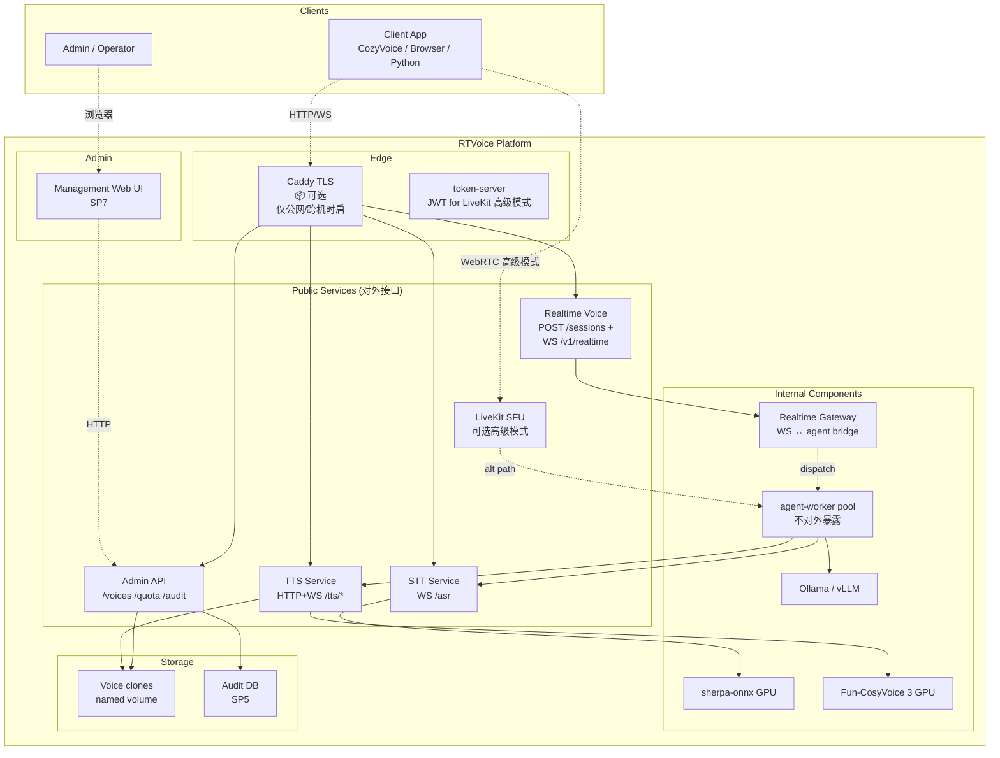

# SP1 · 平台定位 + 文档骨架重构 — 设计文档

**Date**: 2026-05-07
**Sub-project**: SP1（platform-first 重构系列首项）
**Status**: 设计 (待 user review → writing-plans)
**Owner**: dreamable.reg@gmail.com

---

## 0. 背景

RTVoice 在 v0.0-v0.7 阶段一直按"voice agent 项目"叙事开发；2026-05-07 用户明确平台定位：

> RTVoice = self-hosted **voice services platform**，提供 3 个对等 service（STT、TTS、Realtime Voice），通过标准 API/WebSocket 给任意应用接入；GPU ≤ 12GB；docker-compose 部署；含管理 UI、用量、审计、音色克隆。

session 复盘发现：项目已具备 platform 底层能力（3 service 都能跑、容错完备、v0.7 双向流式 ws），但**叙事仍 agent-first**；README/ARCHITECTURE 给读者印象是 "voice agent demo"，掩盖了 platform 本质。

SP1 解决叙事/定位错位，**不改代码**，只重写 README + ARCHITECTURE 并对齐其他文档。

---

## 1. SP1 范围（in / out）

### 1.1 In Scope

| 文件 | 动作 |
|---|---|
| `README.md` | **重写** —— platform-first 入口 |
| `ARCHITECTURE.md` | **重写** —— 平台层次叙事 |
| `DEPLOY.md` | **改首屏一段** —— "voice agent 部署"→"platform 部署" |
| `OPERATIONS.md` | **改首屏一段** —— 定位字眼对齐 |
| `COZYVOICE_INTEGRATION.md` | **小改 §1** —— "作为 CozyVoice 后端" 扩成"作为任意客户端的 platform 后端，CozyVoice 是其一" |
| `docs/superpowers/specs/2026-05-07-sp1-platform-positioning-design.md` | 本文，新增 |

### 1.2 Out of Scope（明确不做）

- API 规范统一（路径风格 / 错误码 / 版本 / capability discovery） → **SP1.5**
- 任何代码改动（端点、worker、protocol） → SP2-SP7
- OpenAPI schema / 自动 SDK 生成 → SP1.5
- 老历史文档：`PROD_VALIDATION.md` `CHANGELOG.md` `SECURITY.md` `ENGINES.md` `CONTRIBUTING.md` —— 不动
- v0.7 实测延迟数据写入 README —— 等人耳确认后再补
- `docs/api/*.md` 占位链接 —— 写"即将上线"，不创建空文件

### 1.3 子项目分解（SP1 之外的）

为 forward-looking 在 README "Roadmap" 段中预告，不在 SP1 实际工作:

| Sub-project | 主题 |
|---|---|
| SP1.5 | API 规范 + OpenAPI 草案 |
| SP2 | Multi-tenant Realtime session（动态 session）|
| SP3 | per-turn prompt + memory + 同步 transcript |
| SP4 | 音色克隆 + 语气语调暴露 |
| SP5 | 审计 + 对话记录持久化 |
| SP6 | 用量追踪 + 限流 |
| SP7 | Management Web UI |

---

## 2. 关键设计决策

为 ARCHITECTURE §7 决策日志做基础。SP1 期间敲定的决策:

### D-2026-05-07.1 · 三个 service 完全平铺
- **决策**：README "What's in the box" 用 3 张同等大小的 cards；feature/API list 同等篇幅；不按层次分（不写"STT/TTS 是底层、Realtime 是上层"）
- **理由**：用户期望"3 service 一等公民"，不让 Realtime 显得比另两个更重要

### D-2026-05-07.2 · README 多受众分章节
- **决策**：README 第一屏 5 行 pitch + 60 秒试一下 + 3 service cards；后续分 §集成 / §部署 / §概念 / §Roadmap 4 大块
- **理由**：3 类受众（集成方 / 运维 / 好奇者）+ 入口流量混合，单视角 README 都不友好
- **替代**：纯 audience-navigator 风格（只列受众跳转）—— 但 cards 不平铺

### D-2026-05-07.3 · agent-worker = Model A 内部 implementation detail
- **决策**：agent-worker 是 Realtime Voice service 的内部 worker；客户端**永远不直接接触**；只在 §运维 / §概念 出现，不在 §集成
- **理由**：保留内部演进自由（明天换 livekit-agents 框架对外不破坏）；与 OpenAI Realtime / Vapi / Twilio 行业惯例一致；客户体验最简
- **替代**：
  - Model B reference impl（公开 worker 协议）—— 95% 客户不需要的灵活性，协议僵化代价大
  - Model C default tenant + 渐进 multi-tenant —— 双模式维护负担

### D-2026-05-07.4 · WS gateway 作为 Realtime Voice 主路径，LiveKit 作为可选高级模式
- **决策**：Realtime Voice service 默认通过 `WS /v1/realtime` 暴露（OpenAI Realtime 风格协议）；LiveKit endpoint 作为 advanced mode 保留，仅末端 user 跨公网移动场景用
- **理由**：
  - **延迟分析**：server-to-server (CozyVoice→RTVoice 同 LAN/同机) TCP 与 UDP 差异 < 1ms，无显著区别；LiveKit UDP 优势仅在末端跨公网移动网络抖动场景
  - **集成简化**：客户端零 LiveKit SDK 依赖，标准 WS 任意语言可调
  - **协议自主**：WS 协议自定义 + 演进自由（OpenAI 风格 events）
- **替代**：
  - 纯 LiveKit（v0.7 现状）—— 集成方多 SDK 依赖，体验复杂
  - 纯 WS gateway 删除 LiveKit —— 失去末端用户跨公网场景能力（虽不是核心场景）

### D-2026-05-07.5 · API 规范延后到 SP1.5 独立 sub-project
- **决策**：SP1 仅做"叙事重构"；路径风格 / 错误码 / 版本 / 鉴权统一规则 / capability discovery 留 SP1.5
- **理由**：SP1 改文档不改代码；SP1.5 影响后续 SP2-7 的 API 设计，需要专注

### D-2026-05-07.6 · Caddy TLS 标"可选"
- **决策**：架构图里 Caddy 用虚线框 + "📦 可选 docker-compose.tls.yml" 标注；明确公网必须、内网可选、同机不需要
- **理由**：Bearer auth 是独立鉴权层，TLS 只解决传输加密；不让读者误以为"不开 Caddy 就跑不起来"

---

## 3. README 详细结构（重写后）

### 3.1 第一屏（pitch + cards + try）

```markdown
# RTVoice

[5-line pitch（见下）]

## ⚡ 60 秒试一下
[docker compose up + 3 行测试命令]

## What's in the box
[3 张 service cards: STT / TTS / Realtime Voice]
```

### 3.2 5-line pitch (草稿)

> **RTVoice** —— self-hosted 语音服务平台，三个 service 一等公民：
> 1. **STT 服务** —— 实时流式转写（sherpa-onnx，WebSocket）
> 2. **TTS 服务** —— 流式合成 + 音色克隆（Fun-CosyVoice 3，HTTP + WebSocket）
> 3. **Realtime Voice 服务** —— 端到端语音对话（默认 WebSocket gateway / 可选 LiveKit；本地 LLM；支持 prompt+memory + 同步 transcript + 换音色）
>
> 全栈本地推理，单 GPU ≤ 12GB（RTX 3060/4060 适配），docker-compose 一键启停。
>
> 通过标准 HTTP / WebSocket API 给任意应用接入；内置鉴权、审计开关、用量监控、管理 Web UI。

### 3.3 三 service cards 草稿

```markdown
### 🎤 STT — 流式语音识别
- **接口**：WS `/asr`
- **引擎**：sherpa-onnx Streaming Zipformer 中英文
- **协议**：PCM int16 LE 16kHz mono in → JSON `{partial,final,error}` events out
- **场景**：实时转写、麦克风听写、对话录音
- → [集成示例](./COZYVOICE_INTEGRATION.md#stt) · [API spec](./docs/api/stt.md)（即将上线）

### 🔊 TTS — 流式语音合成 + 音色克隆
- **接口**：HTTP POST `/tts/stream`（单次）+ WS `/tts/stream_ws`（双向流式）
- **引擎**：Fun-CosyVoice 3 (0.5B GPU)
- **协议**：text in（HTTP body 或 WS 流）→ chunked PCM int16 LE 24kHz mono out
- **特性**：音色克隆（POST /voices/add）、speed 0.5-2.0
- → [集成示例](./COZYVOICE_INTEGRATION.md#tts) · [API spec](./docs/api/tts.md)（即将上线）

### 💬 Realtime Voice — 实时语音对话
- **接口**：HTTP POST `/sessions` 创建 + WS `/v1/realtime/{session_id}` 连接
- **协议**：客户端发 PCM in / 收 PCM + transcript events out（OpenAI Realtime 风格）
- **引擎**：内部 STT (sherpa) + LLM (Ollama / vLLM) + TTS (Fun-CosyVoice 3)
- **特性**：双向流式、prompt+memory、同步 transcript、换音色、barge-in
- **高级模式**：LiveKit endpoint 可选保留（适合 end-user 跨公网移动场景）
- → [集成示例](./COZYVOICE_INTEGRATION.md#realtime) · [API spec](./docs/api/sessions.md)（即将上线）
```

### 3.4 60 秒试一下章节草稿

```markdown
## ⚡ 60 秒试一下

```bash
git clone https://github.com/zinohome/RTVoice.git
cd RTVoice
cp .env.example .env       # 默认 dev 配置已可用
docker compose --profile dev up -d
```

| 想试什么 | 怎么试 |
|---|---|
| **STT** | [测试页](http://127.0.0.1:8000/) 录一段；或编程方式见 [STT 集成示例](./COZYVOICE_INTEGRATION.md#stt) |
| **TTS** | `curl -X POST http://127.0.0.1:9880/tts/stream -d '{"text":"你好"}' \| ffplay -f s16le -ar 24000 -` |
| **Realtime 对话** | 浏览器 [测试页](http://127.0.0.1:8000/) → 加入语音 → 说话 |

**首次启动注意**：LLM (Ollama) 需要 `ollama pull qwen2.5:1.5b`（约 1GB）。完整下好后约 3-5 分钟可对话。prod GPU 部署见 [DEPLOY.md](./DEPLOY.md)。
```

### 3.5 后段章节草稿

```markdown
## 🔌 集成 (Integration)
[3-5 行链接到 COZYVOICE_INTEGRATION.md / SECURITY.md / docs/api/(即将上线)]

## 🛠 部署 (Deployment)
[3-5 行链接到 DEPLOY.md / OPERATIONS.md / SECURITY.md / PROD_VALIDATION.md]
[含硬件要求 + 监控提示]

## 📚 概念 (Concepts)
[链接到 ARCHITECTURE.md / ENGINES.md / OPERATIONS §1 容错矩阵 / CHANGELOG.md]

## 🗺 现状 / Roadmap
**已完成**（v0.7）：3 service 单 tenant 可用 + 容错完备 + 双向流式 TTS
**进行中**（platform-first 重构）：SP1 ✅ / SP1.5 / SP2 / SP3 / SP4 / SP5 / SP6 / SP7
[链接到 CHANGELOG.md / Unreleased]
```

---

## 4. ARCHITECTURE.md 详细结构（重写后）

### 4.1 章节大纲

```markdown
§1 Platform Overview          一图 + 1 段总览（见下方 Mermaid）
§2 STT Service                组件 + data flow + 设计权衡
§3 TTS Service                组件 + data flow + 双向流式协议
§4 Realtime Voice Service     默认 WS gateway + 可选 LiveKit + session 抽象
§5 跨服务关注点                鉴权 / TLS / GPU 预算 / 容错矩阵 / 监控
§6 技术栈选型                  各组件选型 + 替代方案 + 链接 ENGINES.md
§7 设计决策日志                Decision Records (D-YYYY-MM-DD.N)
```

### 4.2 §1 Overview Mermaid 图（最终版）



### 4.3 §2-§7 内容要点

**§2 STT Service**：sherpa-onnx OnlineRecognizer + GPU 加速；单 coroutine 处理（sherpa 非 thread-safe）；endpoint detection 关闭；客户端断连自动重连。

**§3 TTS Service**：Fun-CosyVoice 3 (0.5B GPU)；asyncio.Lock 串行化（单 GPU 单 model 实例并发会污染）；CosyVoice instance-attr 重置规约（token_hop_len reset / generator wrap）；voice clone 通过 spk2info.pt 持久化到 named volume。

**§4 Realtime Voice Service**：默认 WS gateway 模式 vs 可选 LiveKit 模式 各一张数据流图；session 生命周期抽象（create→active→idle→expire）；详细 session API + memory 模型属于 SP2/SP3 设计范围，本文仅给抽象架构层。

**§5 跨服务关注点**：
- 鉴权三层：`RTVOICE_API_KEY`（应用层 client）+ `TTS_ADMIN_API_KEY`（admin 高权）+ token-server JWT（仅 LiveKit 高级模式）
- TLS：Caddy 可选层
- GPU 预算表（按 LLM 选型分场景）：
  | 场景 | sherpa | CosyVoice | LLM | 总计 | 12G 余量 |
  | dev (Q4 1.5B) | 1G | 5.5G | 1.5G | 8G | 4G ✓ |
  | prod (Q4 7B) | 1G | 5.5G | 5G | 11.5G | 0.5G ⚠️ 边缘 |
  | prod (Q4 3B) | 1G | 5.5G | 3G | 9.5G | 2.5G ✓ |
- 容错矩阵：引用 OPERATIONS §1
- 监控指标：引用 monitoring/README

**§6 技术栈选型表**：
| 组件 | 选型 | 替代方案 | 为什么 |
|---|---|---|---|
| SFU/WebRTC | LiveKit | Daily / Janus | 文档 + SDK 最完整，开源活跃 |
| STT | sherpa-onnx | whisper / faster-whisper | 流式 + GPU 兼容性 |
| TTS | Fun-CosyVoice 3 | Kokoro / XTTS-v2 / ElevenLabs | v3 双向流式 + 中文 SOTA + 本地 |
| LLM | Ollama / vLLM | 直接 transformers | API 兼容 + 易部署切换 |

链接 [ENGINES.md](../../../ENGINES.md) 详细对比。

**§7 决策日志**：按时间倒序，每个决策含背景、理由、替代方案。本文 §2 列出的 6 个决策（D-2026-05-07.1 至 D-2026-05-07.6）作为新增 entries；历史决策（v0.6/v0.7 期间的 base image / inference_zero_shot 切换 / chown 重排等）追溯补录。

---

## 5. 其他文档小改

### 5.1 DEPLOY.md
- 改首段：`# RTVoice 部署手册` 后第一段："本文档说明 RTVoice 项目从开发机到生产机的部署流程..." → 改成 "本文档说明 RTVoice voice services platform 从开发机到生产机的部署流程..."
- 正文不动

### 5.2 OPERATIONS.md
- 改首段：`面向已经部署 RTVoice 的运维者...` → 加一句 "本文档假定读者熟悉 [README](./README.md) 描述的 platform 三个 service。"
- §1-§8 不动

### 5.3 COZYVOICE_INTEGRATION.md
- 当前 §1 第一段："把 RTVoice 用作 CozyVoice 的本地 STT/TTS 后端"
- 改成："本文档示范如何把 RTVoice 集成到任意客户端项目作为本地后端。CozyVoice 是其一示例；其他场景（Discord bot / 客服系统 / 自动化 / 移动 app）参照同样模式。"
- 其他章节不动

---

## 6. 验收标准（user 怎么知道 SP1 完了）

1. README.md 渲染后第一屏看清"RTVoice 是什么 + 3 service 平铺 + 60 秒能试"
2. ARCHITECTURE.md §1 Overview 图渲染后能看到 platform 拓扑（含 Admin + Storage + Caddy 可选标注）
3. DEPLOY.md / OPERATIONS.md / COZYVOICE_INTEGRATION.md 首段不再用 "voice agent" 字眼，统一为 "platform"
4. 任何阅读人不会得到"RTVoice 是个 voice agent demo" 的印象
5. 所有改动 commit 并 push 到 GitHub main

---

## 7. 时间预估

文件改动量：
- README.md 重写：~150 行（含 Mermaid + 表格）
- ARCHITECTURE.md 重写：~400 行（含 4 张 Mermaid + 表格）
- DEPLOY.md 改首段：~5 行
- OPERATIONS.md 改首段：~5 行
- COZYVOICE_INTEGRATION.md 改首段：~10 行

实施工作（不含 brainstorm 这次）：~3-4 小时纯写作 + 1 小时本地预览渲染 + 半小时 commit/push。

总计：**半天 timebox**。

---

## 8. 转下一步

SP1 设计完成 → user 审 spec → invoke `superpowers:writing-plans` 生成 step-by-step 实现 plan → 实施 → SP1 完成 → 启动 SP1.5 brainstorm（API 规范）。
