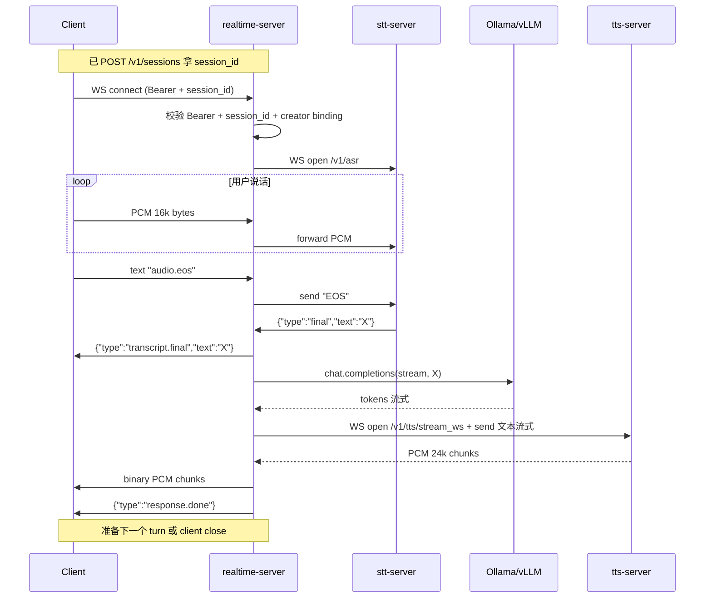

# SP2 · Multi-tenant Realtime Voice session 设计文档

**Date**: 2026-05-08
**Sub-project**: SP2（platform-first 重构系列第三项）
**Status**: 设计 (待 user review → writing-plans)
**Predecessor**: SP1（平台叙事）+ SP1.5（API 规范 + endpoint refactor）
**Successor**: SP3（prompt + memory + 同步 transcript）

---

## 0. 背景

SP1+SP1.5 完工后，RTVoice 已对外提供 STT (`WS /v1/asr`) + TTS (`POST/WS /v1/tts/...`) 两个 service，但 **Realtime Voice service 还不存在**——`POST /v1/sessions` 和 `WS /v1/realtime/{id}` 在文档里是 placeholder，没真实现。当前能演示"实时对话"的只有 `agent-worker` 容器，但它写死单一 LiveKit room（`rtvoice-test`），是给 dev/demo 用的固定 instance，不是 service。

SP2 把 Realtime Voice 变成真 service：任意客户端（CozyVoice / Discord bot / 浏览器）通过 `POST /v1/sessions` 拿 session + `WS /v1/realtime/{id}` 连接说话。**多 tenant 并发**支持。

按 SP1 计划分成两步：
- **SP2 = 基础设施**（session API + WS gateway + 多 tenant + 单 turn 无 memory）
- **SP3 = 智能层**（per-session memory + 客户端补 prompt + transcript.partial + response.text）

SP2 完工时，Realtime Voice 能"听见 → 回答"，但 agent 不记 history（每 turn 独立 LLM 调用）。

---

## 1. SP2 范围（in / out）

### 1.1 In Scope

| 文件 | 动作 |
|---|---|
| `services/realtime-server/Dockerfile` | **新建**（FastAPI + websockets + httpx）|
| `services/realtime-server/requirements.txt` | **新建** |
| `services/realtime-server/app/main.py` | **新建** — FastAPI app + endpoints + auth + handlers |
| `services/realtime-server/app/session_manager.py` | **新建** — Session 类 + in-memory store + lifecycle |
| `services/realtime-server/app/pipeline.py` | **新建** — STT/LLM/TTS 协调（copy-paste 自 agent-worker `_run_pipeline_ws`，去 LiveKit 部分）|
| `services/realtime-server/app/stt_client.py` | **copy** 自 `services/agent-worker/app/stt_client.py` |
| `services/realtime-server/app/llm_client.py` | **copy** 自 `services/agent-worker/app/llm_client.py` |
| `services/realtime-server/app/tts_client.py` | **copy** 自 `services/agent-worker/app/tts_client.py` |
| `services/realtime-server/app/error_schema.py` | **copy**（per-service 同 SP1.5 模板）|
| `services/realtime-server/app/config.py` | **新建** — 集中所有 RTVOICE_* env vars |
| `services/realtime-server/tests/test_session_manager.py` | **新建** — unit test |
| `services/realtime-server/tests/test_pipeline_mock.py` | **新建** — integration test |
| `services/realtime-server/tests/test_endpoints.py` | **新建** — FastAPI TestClient |
| `docker-compose.yml` | **修改** — 加 realtime-server service block |
| `.env.example` | **修改** — 加 7 条 RTVOICE_* env vars + 容量规划注释 |
| `README.md` | **修改** — Realtime Voice card 升 placeholder 为正式描述；60s try 表加 RTV |
| `ARCHITECTURE.md` | **修改** — §1 Overview 图 RTV 实线化；§4 完整内容（去 placeholder）|
| `OPERATIONS.md` | **修改** — §2 加 SP2 env vars；§3 加升级路径；§4 加故障 cookbook |
| `COZYVOICE_INTEGRATION.md` | **修改** — §5 加 RealtimeClient Python SDK 例 |
| `docs/api/sessions.md` | **修改** — 状态从"协议骨架"改"已实现"；填完整 endpoint detail |
| `docs/api/CONVENTIONS.md` | **修改** — error code 表加 `session.*` 系列 |
| `CHANGELOG.md` | **修改** — 加 v0.9.0 entry |

### 1.2 Out of Scope（明确不做）

- **Server-side memory**（SP3 范围）：每 turn LLM 调用不带 history
- **客户端 prompt 透传**（SP3 范围）：SP2 用 server env 设的全局 system prompt
- **transcript.partial / response.text 流式**（SP3 范围）：SP2 只发 transcript.final
- **session.update 热改 voice/speed**（v1 不支持）：voice/speed 在 create 时定
- **session 重连 / WS_DISCONNECT_GRACE > 0**：SP2 强制 grace=0，断开立即清；SP3 加 memory 时再讨论
- **Audit / 持久化**：SP5 范围
- **Per-API-key tracking / quota**：SP6 范围
- **Barge-in（用户中途打断 agent）**：与 transcript.partial 耦合，SP3 一起做
- **agent-worker 改造**：v0.7 LiveKit demo 保留**不变**；SP2 是 additive

### 1.3 子项目分解（SP2 不分子项目）

SP2 是单一 sub-project，1.5-3 天 timebox。不再切。

---

## 2. 关键设计决策

### D-2026-05-08-A.1 · 新 container realtime-server，agent-worker 保留

**决策**：新增 `realtime-server` docker service 提供公开 Realtime Voice service。`agent-worker` 保留作 v0.7 LiveKit demo（rtvoice-test room）不变。

**替代**：B 把 agent-worker 升级成公开 service / C 多 worker 进程池

**理由**：
- 职责清晰（SP1 D-2026-05-07.3 Model A 黑盒原则一致）
- 不破坏 v0.7 demo（保留 LiveKit advanced mode 测试路径）
- agent-worker 进维护模式（CHANGELOG / OPERATIONS 显式标）
- 单 GPU 单进程异步 multiplex 够撑 5-10 并发 session，无需多进程

### D-2026-05-08-A.2 · 所有 concurrency 参数 env-driven

**决策**：MAX_CONCURRENT_SESSIONS / SESSION_QUEUE_DEPTH / IDLE_TIMEOUT / MAX_LIFETIME / DISCONNECT_GRACE / TTS_MODEL_REPLICAS / LLM_MAX_CONCURRENT 全用 env，默认调优 RTX 3060 12GB。

**理由**：用户 2026-05-08 明确："开发阶段 12GB GPU 跑闭环；未来 GPU 扩容只改 .env 不改代码"。env 是天然的 hardware ↔ software 解耦层。

### D-2026-05-08-A.3 · pipeline 代码 copy-paste，不抽 shared lib

**决策**：从 `agent-worker/app/_run_pipeline_ws` 复制到 `realtime-server/app/pipeline.py`，独立演进。

**替代**：B 抽 `services/_shared/pipeline.py` 跨 service 共享 / C agent-worker 改造成 multi-tenant 主线

**理由**：
- 与 SP1.5 决策一致（error_schema.py 也是 per-service copy；不引入跨 service 共享目录）
- 代码量小（~150 行）copy 成本可接受
- agent-worker 进维护模式后不再演进，drift 风险有限
- realtime-server 是新主线，bug fix 都在它上做

### D-2026-05-08-A.4 · WS 协议含 transcript.final，不含 partial / response.text

**决策**：SP2 server → client 文字事件**只**有 `transcript.final`（用户说了什么）。`transcript.partial`（流式中间）+ `response.text`（agent 回复文字流）留 SP3。

**替代**：A 极简（无文字事件）/ C 全协议提前实现

**理由**：
- transcript.final 单条输出，实现成本极小
- 客户端调试/UI 必须看到"server 听到什么"
- partial + response.text 是 streaming 模式，与 SP3 memory 协议绑死，提前做会偷 SP3 工作

### D-2026-05-08-A.5 · session_id Stripe 风格 + Bearer + creator binding

**决策**：
- session_id 格式：`sess_<token_urlsafe(12)>`（如 `sess_V1StGXR8Z5j6B`）
- 鉴权：HTTP/WS 都要 Bearer
- 绑定：server 维护 `{session_id: creator_key_hash}` dict；WS 连接时校验 Bearer hash 与 creator hash 一致

**替代**：A UUID + Bearer 无绑定 / C ephemeral token (OpenAI Realtime 风格)

**理由**：
- Stripe 风格 ID grep log 易调试
- 创建者绑定提供"key 泄露不能劫持别 client session"的隔离
- C 完全安全但过度设计；CozyVoice 是 trusted backend

### D-2026-05-08-A.6 · Turn 级串行（一 session 内不允许并发 turn）

**决策**：客户端发第二个 `audio.eos` 但前一 turn 还没结束 → server 返 `{type:"error","code":"turn.in_progress"}`，不开新 turn。

**理由**：
- TTS GPU lock 已经是单实例 + 串行
- LLM streaming 也是 stateful（per-stream cancellation 复杂）
- v1 简化：用户必须等 agent 说完才能开始下一句
- SP3 加 barge-in 时改这条

---

## 3. 整体架构

### 3.1 docker-compose 拓扑

```
┌──────────────────────────────────────────────────────────────────┐
│                           Clients                                 │
│  CozyVoice / Browser / Python SDK / curl                         │
└────────────────────────────┬─────────────────────────────────────┘
                             │ Bearer + WS/HTTP
                  ┌──────────┴──────────────┐
                  │                         │
        ┌─────────▼─────────┐    ┌─────────▼─────────┐
        │   realtime-server │    │    token-server   │
        │     (NEW SP2)     │    │   /v1/tokens      │
        │  /v1/sessions     │    │  (LiveKit JWT)    │
        │  /v1/realtime/{id}│    │                   │
        └────┬───────┬──────┘    └────────┬──────────┘
             │       │                    │
             │       │                    │
        ┌────▼───┐  ┌▼──────────┐    ┌───▼──────────┐
        │stt-srv │  │tts-srv    │    │livekit-server│
        │/v1/asr │  │/v1/tts/...│    │  WebRTC SFU  │
        └────────┘  └───────────┘    └──────┬───────┘
                                            │
                                     ┌──────▼─────┐
                                     │agent-worker│  ← v0.7 demo
                                     │ (固定 room)│    保留不变
                                     └────────────┘
```

### 3.2 realtime-server 文件结构

```
services/realtime-server/
├── Dockerfile                         # python:3.11-slim + fastapi
├── requirements.txt                   # fastapi, uvicorn, websockets, httpx, pydantic
└── app/
    ├── main.py                        # FastAPI app + 2 endpoints + handlers (~150 行)
    ├── config.py                      # env vars 集中 (~50 行)
    ├── session_manager.py             # Session class + dict store + expire loop (~150 行)
    ├── pipeline.py                    # run_turn() (copy-paste from agent-worker, ~150 行)
    ├── stt_client.py                  # copy from agent-worker
    ├── llm_client.py                  # copy from agent-worker
    ├── tts_client.py                  # copy from agent-worker
    └── error_schema.py                # per-service copy (与 stt/tts/token-server 一致)

tests/
├── test_session_manager.py            # 单元测试
├── test_pipeline_mock.py              # integration with mocks
├── test_endpoints.py                  # FastAPI TestClient
└── conftest.py
```

总代码量预估：~900 行（~600 行 copy + ~300 行新写）。

### 3.3 docker-compose.yml 集成

```yaml
realtime-server:
  build:
    context: ./services/realtime-server
  image: rtvoice/realtime-server:v0.9.0
  container_name: rtvoice-realtime
  profiles: ["dev", "prod"]
  restart: unless-stopped
  networks: [rtvoice_net]
  depends_on:
    stt-server:
      condition: service_healthy
    tts-server:
      condition: service_healthy
  environment:
    LOG_LEVEL: ${LOG_LEVEL:-INFO}
    RTVOICE_API_KEY: ${RTVOICE_API_KEY:-}
    STT_WS_URL: ws://stt-server:9090/v1/asr
    LLM_BASE_URL: ${LLM_BASE_URL:-http://llm-server:11434/v1}
    LLM_MODEL: ${LLM_MODEL:-qwen2.5:1.5b}
    LLM_API_KEY: ollama
    TTS_BASE_URL: http://tts-server:9880
    PUBLIC_WS_BASE: ${PUBLIC_WS_BASE:-ws://realtime-server:9000}
    AGENT_SYSTEM_PROMPT: ${AGENT_SYSTEM_PROMPT:-}
    AGENT_LLM_MAX_TOKENS: ${AGENT_LLM_MAX_TOKENS:-80}
    RTVOICE_MAX_CONCURRENT_SESSIONS: ${RTVOICE_MAX_CONCURRENT_SESSIONS:-5}
    RTVOICE_SESSION_QUEUE_DEPTH: ${RTVOICE_SESSION_QUEUE_DEPTH:-0}
    RTVOICE_SESSION_CREATE_TIMEOUT_S: ${RTVOICE_SESSION_CREATE_TIMEOUT_S:-60}
    RTVOICE_SESSION_IDLE_TIMEOUT_S: ${RTVOICE_SESSION_IDLE_TIMEOUT_S:-30}
    RTVOICE_SESSION_MAX_LIFETIME_S: ${RTVOICE_SESSION_MAX_LIFETIME_S:-1800}
    RTVOICE_WS_DISCONNECT_GRACE_S: ${RTVOICE_WS_DISCONNECT_GRACE_S:-0}
    RTVOICE_TURN_TIMEOUT_S: ${RTVOICE_TURN_TIMEOUT_S:-60}
  expose:
    - "9000"
  healthcheck:
    test: ["CMD", "python", "-c", "import urllib.request,sys; sys.exit(0 if urllib.request.urlopen('http://127.0.0.1:9000/health',timeout=2).status==200 else 1)"]
    interval: 10s
    timeout: 3s
    retries: 3
    start_period: 10s
  deploy:
    resources:
      limits:
        memory: 512M
        cpus: "1.5"
  logging:
    driver: json-file
    options:
      max-size: "30m"
      max-file: "3"
```

公开端口暴露走已有 `docker-compose.api.yml` override 模式（同 STT/TTS 风格）。

---

## 4. API 详细 schema

### 4.1 POST /v1/sessions

**Request body (Pydantic)**:

```python
class SessionCreateRequest(BaseModel):
    voice: str | None = Field(None, description="TTS voice spk_id, default: default_zh_female")
    speed: float = Field(1.0, ge=0.5, le=2.0, description="TTS speed factor")
```

**Response (201)**:

```python
class SessionCreateResponse(BaseModel):
    session_id: str        # "sess_xxx"
    ws_url: str            # 完整 WS URL (含 host)
    expires_at: str        # RFC 3339, now + MAX_LIFETIME
    voice: str             # 实际生效的 voice
    speed: float
```

**Headers**:
- `Authorization: Bearer <RTVOICE_API_KEY>`（dev 留空时跳过）
- `X-Request-ID`（可选）

**Error codes**:

| HTTP | code | 说明 |
|---|---|---|
| 401 | `auth.invalid_token` / `auth.missing_token` | Bearer 错/缺 |
| 422 | `validation.invalid_request` | speed 越界等 |
| 503 | `session.capacity_full` | 超过 `MAX_CONCURRENT_SESSIONS` |

### 4.2 WS /v1/realtime/{session_id}

**鉴权三路**（同 STT WS）:
- Header: `Authorization: Bearer <KEY>`
- Subprotocol: `bearer.<KEY>`
- Query: `?token=<KEY>`

server 校验 Bearer + session_id 存在 + Bearer hash 与 creator hash 匹配。

**Close codes**:

| Code | 含义 |
|---|---|
| 4401 | unauthorized (Bearer 错) |
| 4403 | session.unauthorized (key 不匹配 creator) |
| 4404 | session.not_found |
| 4408 | session.idle_timeout |
| 4410 | session.expired |

**Client → Server messages**:

| Type | Payload | 说明 |
|---|---|---|
| binary | PCM int16 LE 16kHz mono | 用户音频流 |
| text `"audio.eos"` | — | 当前 turn 用户发言结束，触发 server pipeline |

**Server → Client messages**（每 turn）:

| Type | Payload | 时机 |
|---|---|---|
| text | `{"type":"transcript.final","text":"..."}` | STT final（用户说了什么）|
| binary | PCM int16 LE 24kHz mono chunks | agent 回复音频（流式）|
| text | `{"type":"response.done"}` | 本 turn 结束 |
| text | `{"type":"error","code":"...","message":"...","request_id":null}` | turn 内任意失败 |

### 4.3 完整 turn 流程图



---

## 5. Session 生命周期

### 5.1 状态机

```
                  POST /v1/sessions
                         ↓
                    [CREATED]  ── (CREATE_TIMEOUT 60s 内 client 不连 ws)
                         ↓                               ↓ (超时)
                    [ACTIVE]                         [CLEANUP]
                       │
                       ├─ ws idle (IDLE_TIMEOUT 30s)
                       ├─ max lifetime 到 (MAX_LIFETIME 30 min)
                       ├─ ws close（client 主动）
                       ├─ pipeline error（turn 级 error 不 cleanup session）
                       ↓
                    [CLEANUP]
                       ↓
                    [REMOVED] from session_manager
```

### 5.2 5 个 timeouts（全 env-driven）

| Env var | 默认（3060 12GB）| 触发动作 |
|---|---|---|
| `RTVOICE_SESSION_CREATE_TIMEOUT_S` | `60` | POST /sessions 后 client 不连 ws → cleanup |
| `RTVOICE_SESSION_IDLE_TIMEOUT_S` | `30` | client → server 两次消息（PCM/EOS）间隔 > 30s → close ws + cleanup（即用户停下不说话也不发任何控制消息）|
| `RTVOICE_SESSION_MAX_LIFETIME_S` | `1800`（30 min）| 单 session 总寿命硬上限 |
| `RTVOICE_WS_DISCONNECT_GRACE_S` | `0` | ws 断开后 cleanup 等待时间（SP2 = 0；SP3 加 memory 时可能改 300）|
| `RTVOICE_TURN_TIMEOUT_S` | `60` | 单 turn server 处理（STT+LLM+TTS）超时 → 发 error，重置 turn 状态（不 close session）|

### 5.3 7 个 concurrency 参数

| Env var | 默认 | 含义 |
|---|---|---|
| `RTVOICE_MAX_CONCURRENT_SESSIONS` | `5` | 同时活的 session 上限；超过返 503 |
| `RTVOICE_SESSION_QUEUE_DEPTH` | `0` | 超 cap 时排队深度（SP2 v1 = 0 立即拒）|
| `RTVOICE_TTS_MODEL_REPLICAS` | `1` | TTS 模型实例数；现在 hard 1（CosyVoice 单实例 + lock）；未来 GPU 扩容时调高 |
| `RTVOICE_LLM_MAX_CONCURRENT` | `4` | 同时调 LLM 的请求数；Ollama 内部排队 |

### 5.4 Sizing 速查表（写进 .env.example 注释）

```
# 单 GPU 12GB (RTX 3060/4060)：默认值
# 单 GPU 24GB (RTX 3090/4090)：
#   RTVOICE_MAX_CONCURRENT_SESSIONS=10
#   RTVOICE_TTS_MODEL_REPLICAS=2  (需 SP6+ worker pool 实现)
#   RTVOICE_LLM_MAX_CONCURRENT=8
# 多 GPU box：等 SP6+ 实现 GPU 调度后再说
```

### 5.5 Session in-memory store

```python
# session_manager.py
@dataclass
class Session:
    id: str                                # "sess_xxx"
    creator_key_hash: str                  # sha256(api_key)[:16]
    voice: str
    speed: float
    created_at: datetime
    expires_at: datetime                   # = created_at + MAX_LIFETIME
    state: Literal["CREATED","ACTIVE","CLEANUP"]
    ws: WebSocket | None                   # None 时还在 CREATED
    last_activity: datetime                # 收到 PCM/EOS 时更新
    current_turn_task: asyncio.Task | None
    stt_client: STTClient | None
    llm_client: LLMClient | None
    tts_client: TTSClient | None

class SessionManager:
    _sessions: dict[str, Session]
    _capacity_lock: asyncio.Lock
    _expire_task: asyncio.Task

    async def create(self, creator_key_hash: str, voice: str, speed: float) -> Session: ...
    def get(self, session_id: str) -> Session | None: ...
    def attach_ws(self, session_id: str, ws: WebSocket) -> bool: ...
    async def cleanup(self, session_id: str, reason: str): ...
    def active_count(self) -> int: ...
    async def _expire_loop(self): ...        # 后台每 5s 扫一遍
```

### 5.6 Resource cleanup 顺序

```python
async def cleanup(self, session_id, reason):
    sess = self._sessions.pop(session_id, None)
    if not sess: return
    log.info("session %s cleanup (reason=%s, lifetime=%ds)",
             session_id, reason, (now() - sess.created_at).total_seconds())
    sess.state = "CLEANUP"

    # 1. cancel 当前 turn 任务（如果还在跑）
    if sess.current_turn_task and not sess.current_turn_task.done():
        sess.current_turn_task.cancel()

    # 2. close 客户端 ws
    if sess.ws:
        try: await sess.ws.close(
            code={"idle":4408,"expired":4410}.get(reason, 1000)
        )
        except: pass

    # 3. close 上游 STT WS（pipeline 内部维护，task cancel 触发 finally 关闭）
    if sess.stt_client: await sess.stt_client.close()
    if sess.tts_client: await sess.tts_client.close()
    if sess.llm_client: await sess.llm_client.close()
```

---

## 6. Pipeline 实现细节

### 6.1 per-turn `run_turn()` 函数

```python
# pipeline.py
async def run_turn(sess: Session, ws: WebSocket):
    """Single turn: client PCM → STT final → LLM → TTS → client PCM + done."""
    sess.current_turn_task = asyncio.current_task()
    try:
        # 1. STT: 之前累积的 PCM 已流式 forward 到 stt-server，发 EOS 拿 final
        final_text = await sess.stt_client.request_final(timeout=STT_FINAL_TIMEOUT_S)
        if not final_text.strip():
            await ws.send_json({"type":"error","code":"stt.empty","message":"no speech detected"})
            return

        # 2. 通知 client STT 结果
        await ws.send_json({"type":"transcript.final","text":final_text})

        # 3-4. LLM stream → TTS WS double-streaming → client PCM
        tts_ws = await sess.tts_client.open_ws()
        try:
            async def feeder():
                try:
                    async for delta in sess.llm_client.stream(final_text):
                        if delta:
                            await tts_ws.send_text(delta)
                finally:
                    await tts_ws.eos()
            feed_task = asyncio.create_task(feeder())

            async for pcm in tts_ws.audio_chunks():
                await ws.send_bytes(pcm)

            await feed_task
        finally:
            await tts_ws.aclose()

        # 5. 通知 client 本 turn 完
        await ws.send_json({"type":"response.done"})

    except asyncio.CancelledError:
        raise
    except Exception as e:
        log.exception("turn failed: %s", e)
        try:
            await ws.send_json({
                "type":"error",
                "code":_classify_error(e),
                "message":str(e)[:200],
                "request_id":None,
            })
        except Exception:
            pass
    finally:
        sess.current_turn_task = None
        sess.last_activity = now()
```

### 6.2 WS 主循环

```python
# main.py
@app.websocket("/v1/realtime/{session_id}")
async def realtime_ws(ws: WebSocket, session_id: str):
    bearer = check_ws_bearer(ws)
    sess = session_mgr.get(session_id)
    if not sess:
        await ws.close(code=4404, reason="session_not_found")
        return
    if sess.creator_key_hash != hash_key(bearer):
        await ws.close(code=4403, reason="session_unauthorized")
        return
    if sess.expires_at < now():
        await ws.close(code=4410, reason="session_expired")
        return

    await ws.accept()
    if not session_mgr.attach_ws(session_id, ws):
        await ws.close(code=1011, reason="attach_failed")
        return

    # 建 STT 长连
    sess.stt_client = STTClient(STT_WS_URL, api_key=RTVOICE_API_KEY)
    await sess.stt_client.connect()

    try:
        while True:
            try:
                msg = await asyncio.wait_for(ws.receive(), timeout=IDLE_TIMEOUT_S)
            except asyncio.TimeoutError:
                await ws.close(code=4408, reason="idle_timeout")
                break

            if msg["type"] == "websocket.disconnect":
                break

            sess.last_activity = now()

            if "bytes" in msg and msg["bytes"]:
                await sess.stt_client.feed(msg["bytes"])
            elif msg.get("text") == "audio.eos":
                if sess.current_turn_task and not sess.current_turn_task.done():
                    await ws.send_json({
                        "type":"error","code":"turn.in_progress",
                        "message":"previous turn not done","request_id":None,
                    })
                else:
                    asyncio.create_task(run_turn(sess, ws))
            else:
                log.debug("unknown msg: %s", msg)

    except WebSocketDisconnect:
        pass
    finally:
        await session_mgr.cleanup(session_id, reason="ws_close")
```

### 6.3 Error 分类 helper

```python
def _classify_error(exc: Exception) -> str:
    """Python exception → CONVENTIONS.md §6 error code"""
    if isinstance(exc, asyncio.TimeoutError):
        return "turn.timeout"
    s = str(exc).lower()
    if "stt" in s: return "stt.failed"
    if "tts" in s: return "tts.failed"
    if "llm" in s or "openai" in s or "ollama" in s: return "llm.failed"
    return "internal.unknown"
```

---

## 7. Error code 总表（加进 CONVENTIONS.md）

| Code | HTTP/WS | 含义 |
|---|---|---|
| `session.capacity_full` | HTTP 503 | 超过 MAX_CONCURRENT_SESSIONS |
| `session.not_found` | WS 4404 | session_id 不存在 |
| `session.unauthorized` | WS 4403 | Bearer 不匹配 creator |
| `session.expired` | WS 4410 | session 超 MAX_LIFETIME |
| `session.idle_timeout` | WS 4408 | ws 闲置超 IDLE_TIMEOUT |
| `turn.timeout` | text event | turn 处理超 TURN_TIMEOUT |
| `turn.in_progress` | text event | 前 turn 未结束就发新 audio.eos |
| `stt.empty` | text event | STT final 为空（用户没说出有效内容）|
| `stt.failed` | text event | STT 调用失败 |
| `llm.failed` | text event | LLM 调用失败 |
| `tts.failed` | text event | TTS 调用失败 |
| `internal.upstream_closed` | text event | 上游 service WS 断开 |

---

## 8. 验收标准

### 8.1 沙盒自动测试

1. realtime-server `/openapi.json` 含 `POST /v1/sessions`
2. realtime-server `/health` 返 200
3. unit test: SessionManager.create / lookup / cleanup / capacity / expire 逻辑覆盖
4. integration test: 完整 turn 流程（mock STT/LLM/TTS clients）发出预期 event 序列
5. 错误码完整覆盖（capacity_full / not_found / unauthorized / expired / turn.in_progress 各 1 测试）
6. WS 鉴权三路（header / subprotocol / query）+ creator binding 各 1 测试

### 8.2 prod 集成测试（**user 参与**）

1. SSH prod，git pull + rebuild realtime-server + up -d
2. `curl -X POST /v1/sessions` 返 201 + ws_url
3. `curl -X POST /v1/sessions` 不带 Bearer → 401（如设了 RTVOICE_API_KEY）
4. websocat 完整 turn：
   - 创建 session 拿 ws_url
   - 连 ws → 发预录 PCM 文件 → 发 audio.eos
   - 收 transcript.final + binary PCM + response.done
   - PCM 写文件 → ffplay 播放验是 agent 回复
5. 多 session 容量测试：同时 6 个 client POST /v1/sessions → 第 6 个返 503
6. session 闲置 30s → server 主动 close code 4408
7. 验**老 LiveKit demo 仍可用**（agent-worker rtvoice-test 不破）

### 8.3 SP2 完工的硬指标

上面 7 项 prod 测全过 **+** agent-worker LiveKit demo 不破 = SP2 done。

---

## 9. 风险与缓解

| 风险 | 概率 | 影响 | 缓解 |
|---|---|---|---|
| copy-paste pipeline 与 agent-worker drift | 中 | bug 修两次 | agent-worker 进维护模式；CHANGELOG / OPERATIONS 显式标 |
| TTS 单实例 lock + 多 session 排队体感差 | 中 | 5 用户中 4-5 名感觉慢 | env cap=5 默认；docs 写 sizing 指引；future SP6 加 GPU 扩容 |
| In-memory session store 重启丢失 | 中 | 重启时活 session 失效 | SP2 接受（短 session 重创即可）；SP5 加 audit DB 时可顺便持久化 metadata |
| WS 鉴权三路 attack surface 多 | 低 | 多一种被滥用 | Bearer 仍核心；query/subprotocol 仅 fallback；与 STT/TTS 一致 |
| session_id collision | 极低 | 两 session 同 id | 16 字节 token_urlsafe 碰撞 < 1e-19 |
| LLM cold start 慢导致 turn timeout | 中 | 第一次对话 fallback | LLM 默认已有 0-token fallback（v0.6.2）；TURN_TIMEOUT=60s 给足 cold start 余量 |

---

## 10. 时间预估

| 工作类 | 预估 |
|---|---|
| 创建 realtime-server 目录 + Dockerfile + requirements | 0.5 小时 |
| copy-paste 4 client 文件 + error_schema.py + 调整 | 0.5 小时 |
| 写 config.py（env vars 集中）| 0.5 小时 |
| 写 session_manager.py（Session class + dict + expire loop）| 1.5 小时 |
| 写 pipeline.py（run_turn 简化版）| 1 小时 |
| 写 main.py（FastAPI app + 2 endpoints + auth + WS 主循环）| 1.5 小时 |
| 写 3 个测试文件 | 1.5 小时 |
| docker-compose.yml + .env.example 更新 | 0.5 小时 |
| 文档更新（README / ARCH / OPS / COZY / docs/api/sessions.md / CONVENTIONS）| 1.5 小时 |
| CHANGELOG | 0.3 小时 |
| 沙盒 build + smoke test | 0.5 小时 |
| prod 集成测试（user 参与）| 0.5 小时 |

**总计**：~10 小时 ≈ **1.5-2 天 timebox**。

---

## 11. 转下一步

SP2 设计完成 → user 审 spec → invoke `superpowers:writing-plans` 生成 step-by-step 实施 plan → subagent-driven 实施 → SP2 完成 → 启动 SP3 brainstorm（prompt + memory + sync transcript）。
