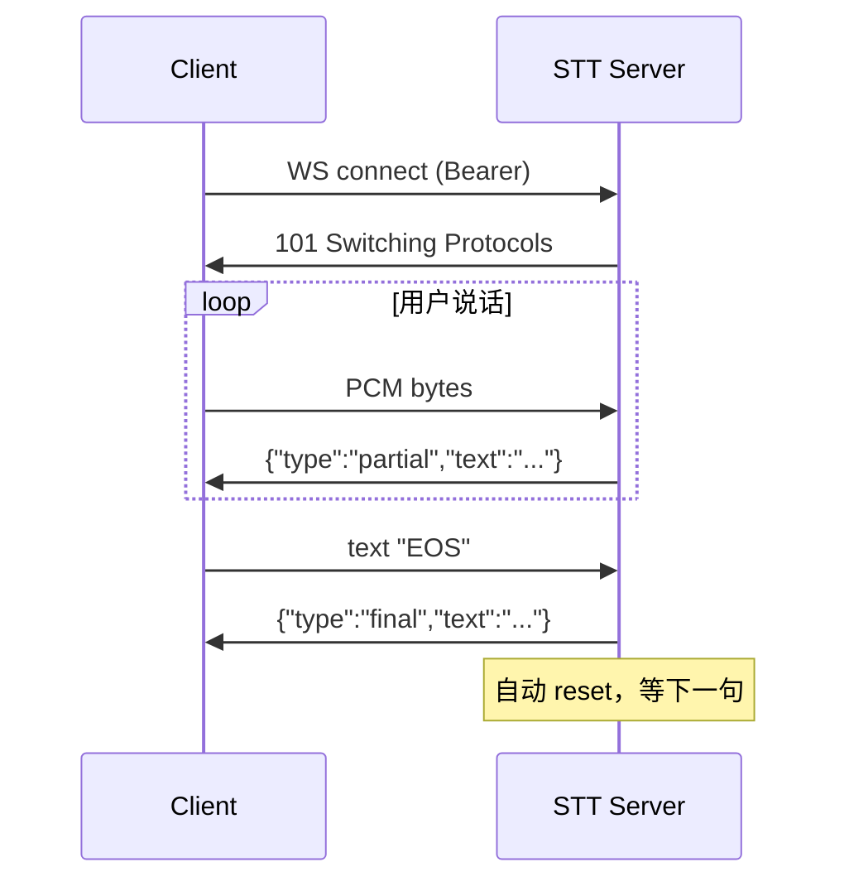

# STT Service API

> 实时流式语音识别。sherpa-onnx Streaming Zipformer 中英文。

## Endpoints 速查

| 用途 | 方法 | 路径 | 鉴权 |
|---|---|---|---|
| 流式识别 | WS | `/v1/asr` | Bearer |
| 健康检查 | GET | `/health` | 无 |
| 服务信息 | GET | `/info` | 无 |
| OpenAPI schema | GET | `/openapi.json` | 无 |
| Prometheus 指标 | GET | `/metrics` | 无 |

## WS /v1/asr

### 鉴权

三路任一（详见 [CONVENTIONS.md §7](CONVENTIONS.md#§7-鉴权)）：
- Header: `Authorization: Bearer <RTVOICE_API_KEY>`
- Subprotocol: `Sec-WebSocket-Protocol: bearer.<KEY>`
- Query: `?token=<KEY>`

### Client → Server messages

| Type | Payload | 何时发 |
|---|---|---|
| binary | PCM int16 LE 16kHz mono samples | 持续，建议 20-100ms 一帧 |
| text `"EOS"` | — | 用户发言结束，触发 final |
| text `"RESET"` | — | 丢弃当前 stream（一般不必，server 在 final 后自动 reset）|

### Server → Client messages (JSON events)

| Type | Schema | 时机 |
|---|---|---|
| `{"type":"partial","text":"..."}` | partial 转写 | streaming 中持续 |
| `{"type":"final","text":"..."}` | final 转写 | 收到 EOS 或 endpoint 触发后 |
| `{"type":"error","code":"...","message":"..."}` | 错误 | 失败时 |

### State diagram



### 常见 error codes

| Code | HTTP/WS close code | 含义 |
|---|---|---|
| `auth.invalid_token` | WS 4401 | Bearer 不对 |
| `stt.invalid_audio` | WS 4400 | PCM 格式不对（非 16kHz / 非 int16 LE / 非 mono）|
| `internal.unknown` | WS 1011 | server 异常，看 log |

### Try it (Python)

```python
import asyncio, json, websockets

async def transcribe(pcm_bytes: bytes, api_key: str) -> str:
    async with websockets.connect(
        "ws://localhost:9090/v1/asr",
        additional_headers={"Authorization": f"Bearer {api_key}"},
    ) as ws:
        # 切 100ms 帧
        chunk_size = 16000 * 2 // 10
        for i in range(0, len(pcm_bytes), chunk_size):
            await ws.send(pcm_bytes[i:i+chunk_size])
        await ws.send("EOS")
        async for msg in ws:
            ev = json.loads(msg)
            if ev["type"] == "final":
                return ev["text"]
        return ""

# 用法
text = asyncio.run(transcribe(open("u.pcm","rb").read(), "your-key"))
```

### Try it (Node)

```js
import WebSocket from 'ws';
import fs from 'fs';

const ws = new WebSocket('ws://localhost:9090/v1/asr', {
  headers: { Authorization: `Bearer ${process.env.RTVOICE_API_KEY}` }
});
ws.on('open', () => {
  const pcm = fs.readFileSync('u.pcm');
  for (let i = 0; i < pcm.length; i += 3200) ws.send(pcm.slice(i, i+3200));
  ws.send('EOS');
});
ws.on('message', d => {
  const ev = JSON.parse(d.toString());
  if (ev.type === 'final') { console.log(ev.text); ws.close(); }
});
```

## GET /info

返:
```json
{
  "name": "stt-server",
  "version": "0.8.0",
  "capabilities": {
    "streaming": true,
    "sample_rate": 16000,
    "channels": 1,
    "model": "sherpa-onnx-streaming-zipformer-bilingual-zh-en"
  }
}
```

## GET /health

返 `{"status":"ok"|"loading"}`，HTTP 200。
