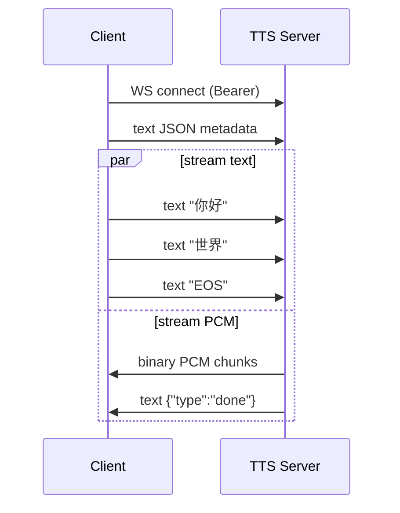

# TTS Service API

> 流式语音合成 + 音色克隆。**当前版本：Fun-CosyVoice 3 (0.5B GPU) v0.20.1**，镜像 `rtvoice/tts-server-cosyvoice3:v0.20.1`。

## Endpoints 速查

| 用途 | 方法 | 路径 | 鉴权 |
|---|---|---|---|
| HTTP 单次合成 | POST | `/v1/tts/stream` | Bearer |
| WS 双向流式合成（v0.7+）| WS | `/v1/tts/stream_ws` | Bearer |
| 列出音色 | GET | `/v1/voices` | Bearer |
| 注册音色（admin）| POST | `/v1/voices` | TTS_ADMIN_API_KEY |
| 删除音色（admin）| DELETE | `/v1/voices/{spk_id}` | TTS_ADMIN_API_KEY |
| 健康检查 | GET | `/health` | 无 |
| 服务信息 | GET | `/info` | 无 |
| OpenAPI schema | GET | `/openapi.json` | 无 |
| Prometheus 指标 | GET | `/metrics` | 无 |

## POST /v1/tts/stream

### Request

```http
POST /v1/tts/stream HTTP/1.1
Authorization: Bearer <RTVOICE_API_KEY>
Content-Type: application/json

{
  "text": "你好世界",
  "voice": "default_zh_female",
  "speed": 1.0
}
```

### Response

```http
HTTP/1.1 200 OK
Transfer-Encoding: chunked
Content-Type: application/octet-stream
X-Sample-Rate: 24000
X-Channels: 1
X-Format: pcm-int16-le

<chunked PCM bytes>
```

### Body schema

```json
{
  "text": "string (1-2000 字)",
  "voice": "string | null (默认 default_zh_female)",
  "speed": "float 0.5-2.0 (默认 1.0)",
  "lang": "string | null (CosyVoice 自动判语言，可忽略)"
}
```

### Error codes

| Code | HTTP | 含义 |
|---|---|---|
| `auth.invalid_token` | 401 | Bearer 不对 |
| `tts.not_ready` | 503 | model loading，重试 |
| `tts.voice_not_found` | 400 | voice 不存在 |
| `internal.unknown` | 500 | server 异常 |

### Try it

```bash
curl -X POST http://localhost:9880/v1/tts/stream \
  -H "Authorization: Bearer $RTVOICE_API_KEY" \
  -H "Content-Type: application/json" \
  -d '{"text":"你好世界"}' | ffplay -f s16le -ar 24000 -ac 1 -
```

## WS /v1/tts/stream_ws (v0.7+)

双向流式合成：客户端流式发文本，服务端流式返 PCM。延迟 ~150ms 端到端首字节。

### 鉴权

同 STT，三路任一。

### Client → Server messages

| 顺序 | Type | Payload | 说明 |
|---|---|---|---|
| 1 | text (JSON) | `{"voice":"...","speed":1.0}` | metadata 必须首帧 |
| 2..N | text | 文本增量 | 边合成边送 |
| 末 | text `"EOS"` | — | 触发结束 |

### Server → Client messages

| Type | Payload | 时机 |
|---|---|---|
| binary | PCM int16 LE 24kHz mono chunks | 边合成边发 |
| text | `{"type":"done","chunks":N}` | 全部 PCM 发完 |
| text | `{"type":"error","code":"...","message":"..."}` | 失败 |

### State diagram



### Try it (Python)

```python
import asyncio, json, websockets

async def synth_streaming(text_chunks, api_key):
    async with websockets.connect(
        "ws://localhost:9880/v1/tts/stream_ws",
        additional_headers={"Authorization": f"Bearer {api_key}"},
    ) as ws:
        await ws.send(json.dumps({"voice":"default_zh_female","speed":1.0}))
        for chunk in text_chunks:
            await ws.send(chunk)
        await ws.send("EOS")
        async for msg in ws:
            if isinstance(msg, bytes):
                yield msg
            else:
                ev = json.loads(msg)
                if ev["type"] == "done": return
                if ev["type"] == "error":
                    raise RuntimeError(ev["message"])

# 用法
async def main():
    pcm = bytearray()
    async for chunk in synth_streaming(["你好", "世界"], "your-key"):
        pcm.extend(chunk)
    open("out.pcm", "wb").write(pcm)

asyncio.run(main())
```

## GET /v1/voices

返当前注册的音色 ID 列表。

```http
GET /v1/voices
Authorization: Bearer <KEY>

→ {"voices": ["default_zh_female", "alice"]}
```

## POST /v1/voices (admin)

注册新音色 (zero-shot voice clone)。**v0.20.1 起支持自动音频规范化**，无需预先处理音频格式。

### 自动规范化流程（v0.20.1+）

上传时系统自动完成以下处理：

| 步骤 | 说明 |
|------|------|
| ① 单声道 | 立体声/多声道 → 单声道（各声道平均） |
| ② 重采样 | 任意采样率 → 16kHz（CosyVoice 原生要求） |
| ③ 去前导静音 | 20ms 能量帧检测（RMS < -40dBFS），最多检测前 5 秒 |
| ④ 截断到 8 秒 | 从语音起始点取 8 秒（控制显存，CosyVoice 官方推荐 3-10s） |
| ⑤ 文本截断 | 按时长比例截断文本：`字符数 = 总字符 × (8s ÷ 原始时长)` |

示例：上传 30s 32kHz 立体声 WAV + 100 字文本 → 注册为 8s 16kHz mono + 约 27 字

```http
POST /v1/voices
Authorization: Bearer <TTS_ADMIN_API_KEY>
Content-Type: multipart/form-data

spk_id=alice
prompt_text=参考音频对应的完整文字（最多 1000 字，系统按比例自动截断）
file=@any_audio.wav   # 支持 WAV/MP3/FLAC/OGG 等格式，最大 10MB
```

### 响应（201 Created）

```json
{
  "spk_id": "alice",
  "voice_count": 2,
  "original_duration": 30.0,
  "effective_duration": 8.0,
  "effective_text": "（实际注册的截断文本，可核对）"
}
```

### 表单字段说明

| 字段 | 类型 | 必填 | 说明 |
|------|------|------|------|
| `spk_id` | string | ✓ | 音色 ID，仅限字母/数字/下划线/中日韩，最长 64 字 |
| `prompt_text` | string | ✓ | 参考音频对应的完整文本，1-1000 字符 |
| `file` | file | ✓ | 参考音频，支持任意 torchaudio 兼容格式，≤ 10MB |

### Error codes

| Code | HTTP | 含义 |
|------|------|------|
| `auth.admin_disabled` | 403 | TTS_ADMIN_API_KEY 未设置 |
| `auth.invalid_token` | 401 | admin token 不对 |
| `tts.invalid_spk_id` | 400 | spk_id 含非法字符或长度超限 |
| `tts.voice_already_exists` | 409 | spk_id 已存在；先 DELETE 再 POST |
| `tts.invalid_wav` | 400 | 音频文件过小（< 1KB）或无法解码 |
| `tts.wav_too_large` | 413 | 音频 > 10MB |
| `tts.wav_decode_failed` | 400 | 格式不支持 |

## DELETE /v1/voices/{spk_id} (admin)

删除自定义音色。默认音色（`default_zh_female`）受保护不可删。

### Error codes

| Code | HTTP | 含义 |
|---|---|---|
| `tts.default_voice_protected` | 400 | 不能删默认 |
| `tts.voice_not_found` | 404 | spk_id 不存在 |

## GET /info

```json
{
  "name": "tts-server",
  "version": "0.8.0",
  "backend": "cosyvoice3",
  "model": "Fun-CosyVoice3-0.5B-2512",
  "capabilities": {
    "streaming": true,
    "voice_clone": true,
    "text_streaming_ws": true,
    "supported_voices": ["default_zh_female"],
    "sample_rate": 24000
  }
}
```
